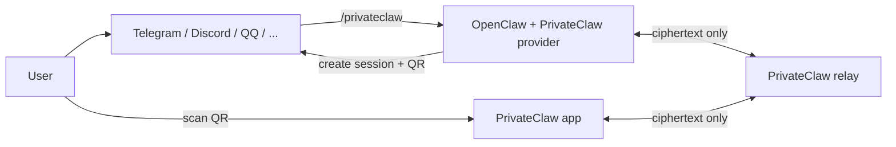

# PrivateClaw

[中文说明](./README.zh-CN.md)

PrivateClaw is a lightweight, end-to-end encrypted private channel for OpenClaw. It lets a user leave a public bot surface, scan a one-time QR code, and continue the conversation inside a dedicated mobile app without giving the relay access to plaintext.

The repository contains:

- `services/relay-server`: a blind WebSocket relay for encrypted session traffic.
- `packages/privateclaw-provider`: the OpenClaw-facing provider runtime and plugin package published as `@privateclaw/privateclaw`.
- `packages/privateclaw-protocol`: the shared invite, envelope, and control-message types.
- `apps/privateclaw_app`: the Flutter mobile client.

## Architecture



### Session flow

1. The provider connects to the relay at `/ws/provider`.
2. `/privateclaw` creates a relay session ID and a local 32-byte session key.
3. The provider returns a one-time `privateclaw://connect?payload=...` QR invite.
4. The mobile app scans the QR code and connects to `/ws/app?sessionId=...`.
5. The app and provider exchange encrypted envelopes using AES-256-GCM.
6. The relay only routes ciphertext plus the metadata needed to deliver it.
7. The provider forwards user messages into OpenClaw and encrypts responses back to the app.

### Security properties

- AES-256-GCM for message envelopes.
- Session key stays local to the provider and the app.
- `sessionId` is bound as additional authenticated data.
- Relay never receives plaintext message contents.
- Session renewal rotates the key without creating a new public invite.

## Repository layout

```text
.
├── apps/privateclaw_app
├── packages/privateclaw-protocol
├── packages/privateclaw-provider
└── services/relay-server
```

## Quick start

### 1. Install dependencies

```bash
npm install
cd apps/privateclaw_app && flutter pub get
cd ../..
```

### 2. Start the relay

For local development:

```bash
npm run docker:relay
```

For a direct Node.js run:

```bash
npm run dev:relay
```

### 3. Install the provider into OpenClaw

From npm:

```bash
openclaw plugins install @privateclaw/privateclaw@latest
openclaw plugins enable privateclaw
openclaw config set plugins.entries.privateclaw.config.relayBaseUrl https://relay.example.com
```

From this repository during development:

```bash
openclaw plugins install --link ./packages/privateclaw-provider
openclaw plugins enable privateclaw
```

PrivateClaw is an OpenClaw plugin command provider, not a built-in chat transport. That means you do **not** configure it with `openclaw channels add privateclaw`. Instead:

- use `openclaw plugins install ...` to install it,
- use `openclaw plugins enable privateclaw` to enable it,
- and configure it under `plugins.entries.privateclaw.config`.

The provider package also exports `resolveRelayEndpoints(...)` if you want to derive provider and app socket URLs from a single relay base URL:

```ts
import { resolveRelayEndpoints } from "@privateclaw/privateclaw";

const relay = resolveRelayEndpoints("https://relay.example.com");
```

### 4. Choose how to start a session

#### Path A: existing OpenClaw chat channel

Add a normal OpenClaw transport such as Telegram, Discord, or QQ:

```bash
openclaw channels add --channel telegram --token <token>
```

Then send `/privateclaw` from that chat surface and scan the returned QR code in the app.

#### Path B: local pairing directly from the OpenClaw CLI

If you want to start a session without another chat app, use the plugin-provided local pair command:

```bash
openclaw privateclaw pair
```

This command creates a session immediately and renders the pairing QR code in your terminal. It keeps the provider session alive until you stop it with `Ctrl+C`.

### 5. Run the app

```bash
cd apps/privateclaw_app
flutter run
```

Then either scan the QR code returned by `/privateclaw` from your existing channel, or scan the QR code rendered by `openclaw privateclaw pair`.

## Self-hosting the relay

The relay is intentionally small. It can run with only Node.js, or as a Docker container with optional Redis-backed frame caching.

### Docker Compose

```bash
docker compose up --build relay
```

With the optional Redis profile:

```bash
PRIVATECLAW_REDIS_URL=redis://redis:6379 docker compose --profile redis up --build
```

### GitHub-hosted container image

This repository includes `.github/workflows/relay-image.yml`, which builds and publishes a multi-architecture relay image to GHCR on pushes to `main`, version tags, and manual runs.

Example:

```bash
docker run --rm \
  -p 8787:8787 \
  -e PRIVATECLAW_RELAY_HOST=0.0.0.0 \
  ghcr.io/topcheer/privateclaw-relay:main
```

### Relay environment variables

The relay reads the following variables directly from the process environment:

| Variable | Default | Purpose |
| --- | --- | --- |
| `PRIVATECLAW_RELAY_HOST` | `127.0.0.1` | Host interface to bind |
| `PRIVATECLAW_RELAY_PORT` | `8787` | Relay HTTP/WebSocket port |
| `PRIVATECLAW_SESSION_TTL_MS` | `900000` | Session lifetime in milliseconds |
| `PRIVATECLAW_FRAME_CACHE_SIZE` | `25` | Buffered ciphertext frames per direction |
| `PRIVATECLAW_REDIS_URL` | unset | Optional Redis URL for encrypted frame caching |

The relay also exposes `/healthz` for container and platform health checks.

## Provider runtime

`@privateclaw/privateclaw` is the published provider/runtime package. It supports:

- OpenClaw plugin registration through `api.registerCommand(...)`
- QR invite generation for `/privateclaw`
- OpenClaw agent, webhook, echo, and OpenAI-compatible bridge modes
- reconnect, heartbeat, session renewal, and dynamic slash-command sync

See `packages/privateclaw-provider/README.md` for package-level usage examples.

## Mobile app

The Flutter app supports:

- QR scanning and manual invite paste
- encrypted chat over the relay
- markdown rendering, best-effort Mermaid support, and media/file rendering
- reconnect, session renewal, and slash-command sync

See `apps/privateclaw_app/README.md` for app-specific commands.

## Development

### Common commands

```bash
npm run build
npm test
npm run dev:relay
npm run demo:provider
```

Flutter app:

```bash
cd apps/privateclaw_app
flutter test
flutter build apk --debug
flutter build ios --simulator
```

### Contributing

1. Clone the repository.
2. Install Node.js dependencies and Flutter dependencies.
3. Run `npm run build` and `npm test` before opening a PR.
4. If you change relay packaging, validate with `docker compose build relay`.

## Published artifacts

- npm provider package: `@privateclaw/privateclaw`
- npm protocol package: `@privateclaw/protocol`
- relay container image: `ghcr.io/topcheer/privateclaw-relay`

## Mobile store delivery

Repository-level shortcuts:

```bash
npm run store:check
npm run store:check:ggai
npm run ios:testflight
npm run ios:testflight:upload
npm run ios:testflight:ggai
npm run ios:testflight:upload:ggai
npm run android:internal
npm run android:internal:upload
npm run android:internal:ggai
npm run android:internal:upload:ggai
```

Supporting metadata-only lanes:

```bash
npm run ios:metadata
npm run android:metadata
```

These commands assume your App Store Connect and Play Console credentials are exported as described in `apps/privateclaw_app/fastlane.env.example`.

Run `npm run store:check` first to confirm that the expected credential environment variables, referenced key files, and existing IPA / AAB artifacts are all visible from your current shell before attempting an upload.

If you keep the same local signing material under `~/ggai/GGAiDoodle`, the `*:ggai` variants auto-load the reusable App Store Connect / Play / keystore settings from that project before running the preflight or fastlane lane. Set `PRIVATECLAW_GGAIDOODLE_ROOT` if your local `GGAiDoodle` checkout lives somewhere else.

The `*:upload` variants skip the rebuild step and upload the existing `apps/privateclaw_app/builds/ios/PrivateClaw.ipa` or `apps/privateclaw_app/build/app/outputs/bundle/release/app-release.aab` directly, which is useful for retrying failed store submissions quickly.

Important Play Console note: for a brand-new Android app, Google requires the first binary upload to be completed manually in Play Console before automated uploads to the `internal` track can take over.

If the Play API returns `Package not found: gg.ai.privateclaw`, finish the first manual Play Console upload for that package and make sure the service account behind your Play JSON key has access to the app.

If the Play API returns `The apk has permissions that require a privacy policy set for the app`, add a public HTTPS privacy policy URL in Play Console before retrying the upload. A project policy document is included at [`PRIVACY.md`](./PRIVACY.md).

The provider publish flow is available from the repository root:

```bash
npm run publish:provider:dry-run
npm run publish:provider
```

## Historical implementation notes

The `OPENCLAW_*` documents in the repository are preserved research and implementation notes from the original integration work. They are useful background material, but the current source of truth is:

- this `README.md`
- `README.zh-CN.md`
- the current source code in `packages/`, `services/`, and `apps/`
