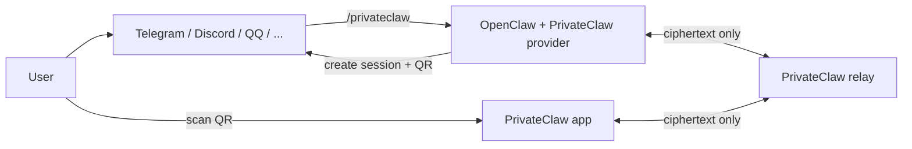
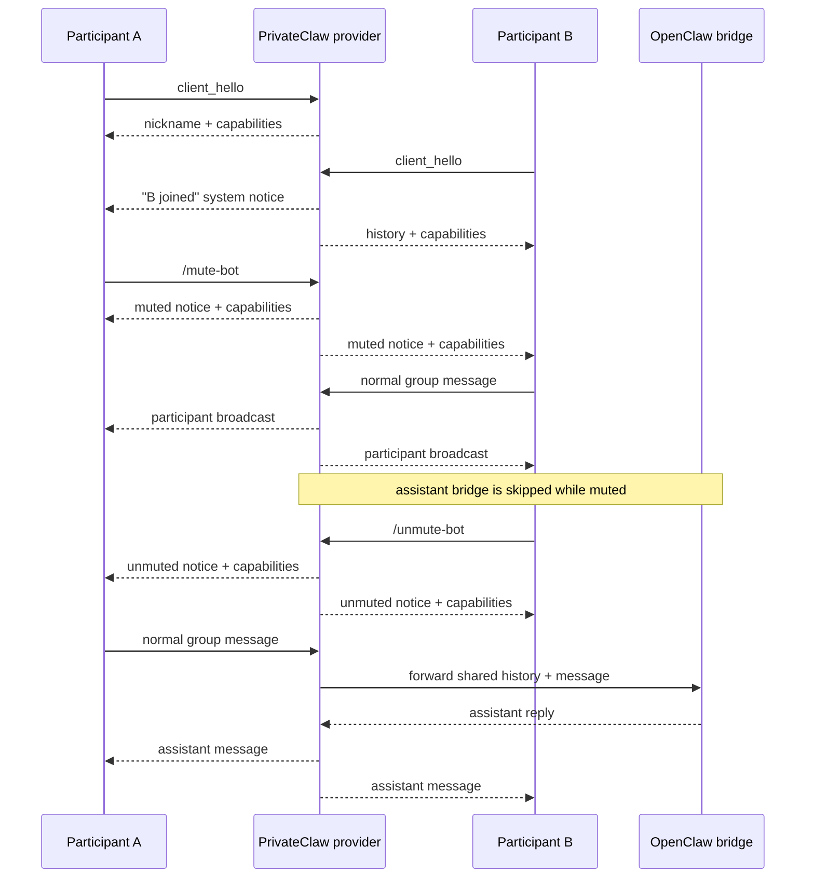

# PrivateClaw

[中文说明](./README.zh-CN.md)

> ## Deploy the relay on Railway
>
> [](https://railway.com/?referralCode=V6e2VV)
>
> Use the Railway one-click entry above to deploy the PrivateClaw relay quickly.

PrivateClaw is a lightweight, end-to-end encrypted private channel for OpenClaw. It lets a user leave a public bot surface, scan a one-time QR code, and continue the conversation inside a dedicated mobile app without giving the relay access to plaintext.

Sessions can stay one-to-one by default, or opt into a small group mode where multiple paired apps share the same encrypted OpenClaw conversation while keeping stable per-install display names inside the chat UI.

Join the community on Telegram: [PrivateClaw Telegram group](https://t.me/+W3RUKxEO9kIxMmZl)

Mobile app access:

- iOS App Store (YourClaw): https://apps.apple.com/us/app/yourclaw/id6760531637
- Android closed alpha tester group: https://groups.google.com/g/gg-studio-ai-products
- Android closed alpha (Google Play): https://play.google.com/store/apps/details?id=gg.ai.privateclaw

For Android closed alpha, Google Play only grants access after the tester has joined the Google Group above.

The repository contains:

- `services/relay-server`: the blind WebSocket relay source, published as `@privateclaw/privateclaw-relay`.
- `packages/privateclaw-provider`: the OpenClaw-facing provider runtime and plugin package published as `@privateclaw/privateclaw`.
- `packages/privateclaw-protocol`: the shared invite, envelope, and control-message types.
- `apps/privateclaw_app`: the Flutter mobile client.

## Architecture



### Session flow

1. The provider connects to the relay at `/ws/provider`.
2. `/privateclaw` creates a relay session ID and a local 32-byte session key.
3. The provider returns a one-time `privateclaw://connect?payload=...` QR invite.
4. The mobile app scans the QR code and connects to `/ws/app?sessionId=...`.
5. The app and provider exchange encrypted envelopes using AES-256-GCM.
6. The relay only routes ciphertext plus the metadata needed to deliver it.
7. The provider forwards user messages into OpenClaw and encrypts responses back to the app.

In optional group mode, the same invite can be scanned by more than one app install. The provider assigns each participant a short stable nickname, broadcasts join/leave notices as gray system messages, keeps the shared OpenClaw conversation alive when one participant leaves, and broadcasts participant messages back to every connected app so the conversation feels like a lightweight encrypted group room.

Provider-generated invite announcements, local pairing output, and built-in PrivateClaw slash-command descriptions are emitted in bilingual Chinese + English text so the same session can be operated from either language context.

### Security properties

- AES-256-GCM for message envelopes.
- Session key stays local to the provider and the app.
- `sessionId` is bound as additional authenticated data.
- Relay never receives plaintext message contents.
- Session renewal rotates the key without creating a new public invite.

### Group lifecycle and bot controls



## Repository layout

```text
.
├── apps/privateclaw_app
├── packages/privateclaw-protocol
├── packages/privateclaw-provider
└── services/relay-server
```

## Production deployment

PrivateClaw's public production relay is:

```text
https://relay.privateclaw.us
```

The repo code now defaults to that relay, so production installs can use it without any extra relay configuration unless you want to override it.

### 1. Install the provider into OpenClaw from npm

Use Node.js 22 or newer on the machine where you install or run the PrivateClaw OpenClaw plugin.

```bash
npm pack @privateclaw/privateclaw@latest
openclaw plugins install ./privateclaw-privateclaw-*.tgz
openclaw plugins enable privateclaw
```

Recent OpenClaw builds try ClawHub first for bare npm specs. That means `openclaw plugins install @privateclaw/privateclaw` follows the newest version currently published on ClawHub, which can lag the newest npm patch. If you want to force the newest npm package immediately, pack it locally and install the generated archive instead.

If you are using the default public relay at `https://relay.privateclaw.us`, the `relayBaseUrl` config step is optional and can be skipped. Only run `openclaw config set plugins.entries.privateclaw.config.relayBaseUrl ...` when you want to change the default relay for the whole plugin. For one-off invites, you can now override the relay per command instead of changing persistent config.

PrivateClaw is an OpenClaw plugin command provider, not a built-in chat transport. That means you do **not** configure it with `openclaw channels add privateclaw`. Instead:

- use `openclaw plugins install ...` to install it,
- use `openclaw plugins enable privateclaw` to enable it,
- and configure it under `plugins.entries.privateclaw.config`.

If you need the newest GitHub checkout immediately instead of the published npm package, install the packed workspace archive instead:

```bash
TARBALL="$(npm pack --workspace @privateclaw/privateclaw | tail -n 1)"
openclaw plugins install "./${TARBALL}"
openclaw plugins enable privateclaw
```

After `openclaw plugins install`, `openclaw plugins enable`, or any `openclaw config set plugins.entries.privateclaw.config...` change, restart the running OpenClaw gateway/service before testing so it reloads the plugin and config. In practice, that means restarting the running `openclaw start` process or whichever service unit is hosting your gateway.

If `openclaw` is already installed on the current machine, the fastest local bootstrap path is now the standalone setup wizard:

```bash
npx -y @privateclaw/privateclaw@latest
```

That standalone `npx` flow checks local OpenClaw, installs or updates the plugin, enables it, restarts the gateway, and then immediately starts pairing. It prompts for single vs group mode and for one of these session-duration presets: `30m`, `2h`, `4h`, `8h`, `24h`, `1w`, `1mo`, `1y`, or `permanent` (`100 years`). Because it downloads the npm package directly, it is also the fastest way to pick up a newer npm patch before the matching ClawHub package is updated.

For repeatable non-interactive runs, you can preselect the same choices:

```bash
npx -y @privateclaw/privateclaw@latest setup --group --duration 24h --open
```

If you want group sessions to feel more like a live chat with a proactive bot participant, you can also enable:

```bash
openclaw config set plugins.entries.privateclaw.config.botMode true
```

That makes the provider greet silent new joiners after about 10 minutes and send a short re-engagement message after about 20 minutes of group silence.

The idle re-engagement path now draws from a built-in bank of 200 whimsical topic prompts and avoids immediately repeating the previous topic for the same session.

`/mute-bot` and `/unmute-bot` also pause or resume these proactive messages.

For advanced tuning, the provider also accepts:

- plugin config overrides: `botModeSilentJoinDelayMs`, `botModeIdleDelayMs`
- environment variables: `PRIVATECLAW_BOT_MODE`, `PRIVATECLAW_BOT_MODE_SILENT_JOIN_DELAY_MS`, `PRIVATECLAW_BOT_MODE_IDLE_DELAY_MS`

The timeout values are in milliseconds. The defaults are `600000` (10 minutes) for silent-join greetings and `1200000` (20 minutes) for idle-group follow-ups. If both plugin config and environment variables are set, plugin config wins.

### 2. Choose how to start a session

#### Path A: existing OpenClaw chat channel

Add a normal OpenClaw transport such as Telegram, Discord, or QQ:

```bash
openclaw channels add --channel telegram --token <token>
```

Then send `/privateclaw` from that chat surface and scan the returned QR code in the app.

Security note: the invite QR / `privateclaw://connect?payload=...` payload carries the one-time session key. Anyone who can scan or paste it can join the session until it expires, so share it only in person or over a channel you trust.

If you want the session to behave like an encrypted group chat, use `/privateclaw group` instead. That keeps one OpenClaw conversation state for the session while allowing multiple app clients to join with distinct participant labels. Individual participants can leave and later rejoin the same invite until the session TTL expires, any connected participant can run `/session-qr` to re-share the current invite QR, and once less than 30 minutes remain the provider emits a reminder to run `/renew-session`. While the group is active, any participant can also use `/mute-bot` and `/unmute-bot` to pause or resume assistant replies without stopping participant-to-participant chat delivery.

If you want just one invite to use a different relay, pass the relay on the slash command itself. Both forms below work:

```text
/privateclaw relay=https://your-relay.example.com
/privateclaw group --relay https://your-relay.example.com
```

The mobile app and web chat both warn before connecting when the QR/invite points at a non-default relay.

##### Channel QR delivery compatibility

When `/privateclaw` returns a pairing QR through an existing OpenClaw chat channel, the practical delivery format is the channel's outbound `ReplyPayload` (`text` plus `mediaUrl` / `mediaUrls`), not the provider's internal attachment model.

- Rich-media channels such as `discord`, `telegram`, `slack`, `signal`, `imessage`, `bluebubbles`, `mattermost`, `msteams`, `matrix`, `googlechat`, `feishu`, `whatsapp`, `line`, and `zalouser` can normally render the generated QR when PrivateClaw sends it as `mediaUrl`.
- `qqbot` still supports the legacy inline `<qqimg>...</qqimg>` path, but its current gateway also consumes structured `mediaUrl` / `mediaUrls`, so it is no longer a tag-only channel.
- `zalo`, `tlon`, and `synology-chat` are URL-oriented: they expect a reachable HTTP(S) media URL rather than a local PNG path.
- `irc`, `nextcloud-talk`, and `twitch` only fall back to a plain text link, and `nostr` currently advertises `media: false`, so those channels should always include the raw invite URI in text because the QR itself may not render inline.

For cross-channel safety, keep the invite URI in the announcement text even when a QR image is also attached.

#### Path B: local pairing directly from the OpenClaw CLI

If you want to start a session without another chat app, the easiest path is now `npx -y @privateclaw/privateclaw@latest` on a machine that already has OpenClaw installed locally. That standalone wizard bootstraps the local plugin install and then starts pairing for you. It also follows npm directly, so it can pick up a newer patch before `openclaw plugins install @privateclaw/privateclaw` does.

Once the plugin is installed and enabled, restart the running OpenClaw gateway/service so it reloads the extension. After that restart, the gateway now brings up the internal PrivateClaw `plugin-service` eagerly, so `openclaw privateclaw pair` no longer depends on first warming the plugin through `/privateclaw` on another chat surface. Then use the provider CLI that it adds to OpenClaw for the shared session-management commands below. The same shared commands also exist on the standalone npm binary as `privateclaw-provider <subcommand>`:

| Command | Purpose | Notes |
| --- | --- | --- |
| `openclaw privateclaw pair` | Create a local PrivateClaw session and render the pairing QR in the terminal. | By default the command returns to the shell after printing while the provider keeps the session alive in a background daemon until expiry. Use `--relay <url>` to override the relay just for this session. |
| `openclaw privateclaw sessions` | List locally managed active sessions. | The output includes the total count plus each session's `type`, `participants`, `state`, `expires`, `host`, and optional `label`. `host` is one of `plugin-service`, `pair-foreground`, or `pair-daemon`. |
| `openclaw privateclaw sessions follow <sessionId>` | Follow the OpenClaw session log for one managed session. | This tails the session JSONL written by OpenClaw so you can watch the agent-side run in real time while keeping provider logs in the current terminal. |
| `openclaw privateclaw sessions qr <sessionId>` | Reprint the QR for a currently managed session. | The QR is rendered in the terminal by default. Add `--open` to also launch the local browser preview, or `--notify` to broadcast the same QR back to the session's currently connected participants as an ephemeral assistant message. |
| `openclaw privateclaw sessions kill <sessionId>` | Terminate a locally managed session. | On current hosts this closes just the selected session. If an already-running older foreground/background host does not support per-session shutdown yet, the command falls back to terminating that legacy host process. |
| `openclaw privateclaw sessions killall` | Terminate every background daemon-managed session. | This only targets `pair-daemon` sessions so it does not interrupt foreground hosts or plugin-service sessions. The standalone binary also exposes the same shortcut as `privateclaw-provider killall`. |
| `openclaw privateclaw kick <sessionId> <appId>` | Remove one participant from a group session. | This closes that app's relay connection and blocks the same `appId` from rejoining the current session. |

`pair` accepts these public flags:

| Flag | Effect |
| --- | --- |
| `--ttl-ms <ms>` | Override the session TTL. The default remains 24 hours. |
| `--label <label>` | Attach an optional relay-side label that also appears in session-management output. |
| `--relay <url>` | Override the relay base URL just for this command without changing plugin config. |
| `--group` | Allow multiple PrivateClaw app clients to join the same session. |
| `--print-only` | Print the invite URI and QR, then exit immediately. This also closes the session instead of leaving it alive. |
| `--open` | Open a local browser preview page for the generated QR. |
| `--foreground` | Keep the session in the current terminal until it ends or you press `Ctrl+C`. On supported runtimes, pressing `Ctrl+D` hands the live session off to a detached background daemon without invalidating the QR. |
| `--verbose` | Emit more detailed provider / bridge debug logs. For live diagnosis, combine it with `--foreground` so the extra logs stay visible in the current terminal. |

For example, to start a local group session and keep it in the foreground until you hand it off or stop it:

```bash
npx -y @privateclaw/privateclaw@latest
npx -y @privateclaw/privateclaw@latest setup --group --duration permanent --open
openclaw privateclaw pair --group --foreground
openclaw privateclaw pair --foreground --verbose
openclaw privateclaw pair --relay https://your-relay.example.com
openclaw privateclaw sessions follow <sessionId>
openclaw privateclaw sessions qr <sessionId> --notify
openclaw privateclaw sessions kill <sessionId>
openclaw privateclaw sessions killall
privateclaw-provider sessions qr <sessionId> --open
privateclaw-provider sessions follow <sessionId>
privateclaw-provider killall
privateclaw-provider pair --relay https://your-relay.example.com --foreground
privateclaw-provider pair --foreground --verbose
```

Background daemon sessions can outlive OpenClaw main-process restarts. Use `openclaw privateclaw sessions` or `privateclaw-provider sessions` to inspect them, `sessions kill <sessionId>` when you want to shut one down explicitly, and `sessions killall` (or standalone `privateclaw-provider killall`) when you want to clear every background daemon session at once.

### Voice STT / ASR

When a user sends a voice attachment, PrivateClaw now tries to transcribe it on the provider side before the message enters the normal OpenClaw text flow.

The runtime order is:

1. local `whisper` CLI from `openai-whisper`, when `whisper` is available on the host
2. provider-side direct STT from the configured OpenClaw audio model or `PRIVATECLAW_STT_*` overrides
3. the bridge `transcribeAudioAttachments(...)` path as the final fallback

If one provider-side layer fails, PrivateClaw logs the fallback and continues to the next layer instead of failing the whole voice turn immediately. For live diagnosis, use `openclaw privateclaw pair --foreground --verbose` or `privateclaw-provider pair --foreground --verbose`.

If you want provider-side network STT from OpenClaw config, configure the default audio model, for example:

```bash
openclaw config set tools.media.audio.models '[{"baseUrl":"http://127.0.0.1:8090","model":"whisper-1","headers":{"Authorization":"Bearer local"}}]' --strict-json
openclaw config validate
```

Optional local `whisper` overrides:

- `PRIVATECLAW_WHISPER_BIN`
- `PRIVATECLAW_WHISPER_MODEL`
- `PRIVATECLAW_WHISPER_LANGUAGE`
- `PRIVATECLAW_WHISPER_DEVICE`
- `PRIVATECLAW_WHISPER_MODEL_DIR`

### 3. Run the app

```bash
cd apps/privateclaw_app
flutter run
```

The mobile app's native Firebase files are intentionally local-only:

- `apps/privateclaw_app/android/app/google-services.json`
- `apps/privateclaw_app/ios/Runner/GoogleService-Info.plist`

If those files are present on your machine, the app can exercise the full Firebase push/background-wake flow. If they are absent, the app still builds and runs, but push stays disabled until you add your own Firebase project configuration.

Officially distributed PrivateClaw app builds only get managed push out of the box when they stay on the default public relay `https://relay.privateclaw.us`. If you switch the app to a custom relay, push also needs that relay plus the app build to be wired to your own Firebase/FCM project and credentials.

Then either scan the QR code returned by `/privateclaw` from your existing channel, or scan the QR code rendered by `openclaw privateclaw pair`.
After the session attaches, the app session panel also shows the current relay server so users can confirm which relay endpoint they are connected to.
If the scanned or pasted invite targets a non-default relay, the app now shows a confirmation warning before it connects.
If you are pairing on a simulator or desktop, you can also paste either the raw `privateclaw://connect?...` link or the full `Invite URI: ...` / `邀请链接 / Invite URI: ...` line into the app.

## Development and testing deployment

### 1. Install dependencies

```bash
npm install
cd apps/privateclaw_app && flutter pub get
cd ../..
```

To enable the repo-managed Git hooks that block accidental commits/pushes of local-only Firebase, relay, and signing credentials, run `npm run hooks:install` once in your clone.

### 2. Start a local relay

For local Docker development:

```bash
npm run docker:relay
```

That script auto-loads ignored local overrides from `services/relay-server/.env` when the file exists, which is the recommended place to keep your own FCM relay credentials for local push debugging.

For a direct Node.js run:

```bash
npm run dev:relay
npx @privateclaw/privateclaw-relay
privateclaw-relay --web
privateclaw-relay --public cloudflare
privateclaw-relay --public tailscale
```

The published relay package exposes the `privateclaw-relay` binary, so you can boot a local relay without cloning the whole repository. Adding `--public cloudflare` starts a temporary Cloudflare quick tunnel, and `--public tailscale` enables Tailscale Funnel for the relay port. If the default local port `8787` is already in use, the CLI automatically retries the next free port and prints the final listening URL.
Adding `--web` also serves the bundled PrivateClaw website from the same process, with the homepage on `/`, the web chat on `/chat/`, and the relay WebSocket endpoints still isolated under `/ws/*`.
If `tailscale` or `cloudflared` is missing, the CLI prints OS-aware install commands and, in an interactive terminal on supported setups, can offer to install/configure the dependency before retrying the public tunnel.
After a public relay URL is ready, the CLI also prints the exact OpenClaw + PrivateClaw provider setup commands. If `openclaw` is available locally, it can offer to run the local provider install-or-update/enable/config flow, restart the gateway, verify that `privateclaw` is registered, and then optionally start a new group pairing. With `--web`, it can also open the bundled web chat with that fresh invite already embedded in the URL.

### 3. Link the local provider checkout into OpenClaw

```bash
openclaw plugins install --link ./packages/privateclaw-provider
openclaw plugins enable privateclaw
openclaw config set plugins.entries.privateclaw.config.relayBaseUrl ws://127.0.0.1:8787
```

Because this flow changes both the installed plugin and the relay target, restart the running OpenClaw gateway/service before testing.

The provider package also exports `resolveRelayEndpoints(...)` if you want to derive provider and app socket URLs from one base URL:

```ts
import { resolveRelayEndpoints } from "@privateclaw/privateclaw";

const relay = resolveRelayEndpoints("ws://127.0.0.1:8787");
```

## Self-hosting the relay

The relay is intentionally small. It can run with only Node.js, or as a Docker container with optional Redis-backed session persistence, distributed frame buffering, and multi-instance coordination.
If you use your own relay instead of `https://relay.privateclaw.us`, point OpenClaw at it with `openclaw config set plugins.entries.privateclaw.config.relayBaseUrl <your-relay-base-url>` and then restart the running OpenClaw gateway/service.

### Docker Compose

```bash
docker compose up --build relay
```

To enable the built-in relay admin UI/API in Docker Compose, pass a fixed bearer token:

```bash
PRIVATECLAW_ADMIN_TOKEN=replace-with-a-long-random-token docker compose up --build relay
```

To enable relay-side wake push locally, copy `services/relay-server/.env.example` to the ignored `services/relay-server/.env` and fill in your own FCM credentials first. Public clones can run the relay without that file, but wake notifications stay disabled until they provide their own config.

With the optional Redis profile:

```bash
PRIVATECLAW_ADMIN_TOKEN=replace-with-a-long-random-token PRIVATECLAW_REDIS_URL=redis://redis:6379 docker compose --profile redis up --build
```

When `PRIVATECLAW_REDIS_URL` / `REDIS_URL` is set, the relay persists session metadata in Redis, keeps buffered encrypted frames there, and lets multiple relay instances share sessions behind a load balancer. Without Redis, relay restarts still drop the in-memory session registry.

### Railway one-click deploy

This repository now includes Railway-ready root configs for both relay flavors:

- `railway.toml` + `Dockerfile.multiarch`: standalone relay container
- `railway.redis.toml` + `Dockerfile.multiarch.redis`: relay container that boots Redis inside the same container

The relay answers both `/healthz` and `/api/health`, and it honors Railway's injected `PORT` automatically when `PRIVATECLAW_RELAY_PORT` is not set.
The Railway images intentionally do not bake `PRIVATECLAW_RELAY_PORT` into the container, so the runtime can bind the platform-provided `PORT` correctly.

Standalone Railway deploy:

1. Create a Railway service from this repository.
2. Keep the default root `railway.toml`.
3. Deploy.

If you want relay restart recovery or multiple relay replicas on Railway, attach a shared Redis service and set `PRIVATECLAW_REDIS_URL` or `REDIS_URL` in the relay service variables.

Embedded-Redis Railway deploy:

1. Replace `railway.toml` with `railway.redis.toml`, or set Railway's Dockerfile path to `Dockerfile.multiarch.redis`.
2. Deploy.

The embedded-Redis image starts Redis on `127.0.0.1:6379` inside the relay container and wires `PRIVATECLAW_REDIS_URL` automatically. It is convenient for a single relay replica, but it does **not** provide cross-instance HA because each container gets its own private Redis.

### Relay-only deployment branch

If your Railway relay service is pinned to the `railway-relay` branch, you can promote a committed relay change without touching your current worktree:

```bash
npm run relay:promote
```

That command checks out the chosen source ref in a temporary `git worktree`, then force-syncs `railway-relay` to that exact commit on both `origin` and `upstream`.

To sync `railway-relay` to a specific committed ref instead of `HEAD`:

```bash
npm run relay:promote -- <commit>
```

Set the Railway relay service source branch to `railway-relay`, and keep regular app, site, and provider work on `main`.

### GitHub-hosted container image

This repository includes `.github/workflows/relay-image.yml`, which builds and publishes a multi-architecture relay image to GHCR on pushes to `main`, version tags, and manual runs.

Example:

```bash
docker run --rm \
  -p 8787:8787 \
  -e PRIVATECLAW_RELAY_HOST=0.0.0.0 \
  ghcr.io/topcheer/privateclaw-relay:main
```

### GitHub-hosted app release artifacts

This repository now also includes `.github/workflows/app-release.yml` for packaging desktop and mobile app artifacts on GitHub-hosted runners.

- Push an `app-v*` tag (for example `app-v0.1.12`) to build and publish a GitHub release automatically.
- Or run the workflow manually with `workflow_dispatch` to build artifacts without creating a release, optionally overriding the resolved build name / build number.
- Desktop artifacts are emitted as:
  - Windows: `.zip` (`x64`, `arm64`)
  - Windows Store: unsigned `.msix` (`x64`) for manual Partner Center upload
  - macOS: `.dmg` (`x64`, `arm64`)
  - Linux: `.tar.gz` (`x64`, `arm64`)
- Mobile artifacts are emitted as:
  - Android: release `.aab` plus split `.apk` files for `arm64` and `x64`
  - iOS: unsigned release `.ipa` plus the matching `.xcarchive` bundle
- This repository also includes `.github/workflows/app-arm-probe.yml` for manual ARM runner experiments. It runs on `ubuntu-24.04-arm` and `windows-11-arm`, records whether the requested Flutter version publishes official `arm64` desktop SDK archives for those hosts, and attempts a real desktop build when Flutter setup succeeds.
- Example:

```bash
gh workflow run app-arm-probe.yml \
  -f flutter_version=3.41.6 \
  -f flutter_channel=stable \
  -f flutter_install_method=flutter-action \
  -f build_mode=release \
  -f run_desktop_build=true \
  -f fail_on_probe_failure=false
```

To test the clone-based workaround discussed in `subosito/flutter-action` issue `#345`, switch to `flutter_install_method=git-clone`. The probe workflow will shallow-clone Flutter from GitHub, add it to `PATH`, and bootstrap it with `flutter doctor` before attempting the desktop build.

Keeping app releases on `app-v*` tags leaves the existing provider / relay npm publish flow on `v*` tags unchanged.

This repo now pins Flutter `3.41.6`, whose official release manifests still only provide `x64` desktop SDK archives for Linux and Windows. To keep `arm64` desktop artifacts enabled anyway, the GitHub app release workflow uses the validated clone-and-bootstrap workaround on `ubuntu-24.04-arm` and `windows-11-arm`: it shallow-clones the `3.41.6` Flutter repo, adds it to `PATH`, and runs `flutter doctor` before the desktop build. macOS continues to use the normal prebuilt SDK path for both `x64` and `arm64`.

### Published relay npm package

The relay is also packaged for npm as `@privateclaw/privateclaw-relay`.

```bash
npm install -g @privateclaw/privateclaw-relay
privateclaw-relay
privateclaw-relay --public cloudflare
privateclaw-relay --public tailscale
```

`--public cloudflare` relies on a local `cloudflared` install and creates a temporary quick tunnel. `--public tailscale` relies on a local `tailscale` install plus Funnel being enabled for your tailnet. If `8787` is already occupied during local startup, `privateclaw-relay` automatically retries the next free port.
When either tunnel CLI is missing, `privateclaw-relay` now prints OS-aware install guidance and can offer an interactive install flow on supported platforms.

### Relay environment variables

The relay reads the following variables directly from the process environment:

| Variable | Default | Purpose |
| --- | --- | --- |
| `PRIVATECLAW_RELAY_HOST` | `127.0.0.1` | Host interface to bind |
| `PRIVATECLAW_RELAY_PORT` | `8787` | Relay HTTP/WebSocket port; falls back to Railway `PORT` when unset |
| `PRIVATECLAW_SESSION_TTL_MS` | `900000` | Session lifetime in milliseconds |
| `PRIVATECLAW_FRAME_CACHE_SIZE` | `25` | Buffered ciphertext frames per direction |
| `PRIVATECLAW_RELAY_INSTANCE_ID` | `RAILWAY_REPLICA_ID` or auto-generated | Optional stable node ID for multi-instance relay logging and handoff coordination |
| `PRIVATECLAW_REDIS_URL` | unset | Optional shared Redis URL for session persistence, distributed frame buffering, and multi-instance relay coordination |
| `REDIS_URL` | unset | Fallback Redis URL alias used when `PRIVATECLAW_REDIS_URL` is unset |

The relay exposes both `/healthz` and `/api/health` for container and platform health checks.

## Provider runtime

`@privateclaw/privateclaw` is the published provider/runtime package. It supports:

- OpenClaw plugin registration through `api.registerCommand(...)`
- QR invite generation for `/privateclaw`, `/privateclaw group`, and `openclaw privateclaw pair --group`
- bilingual invite / CLI / command output for built-in PrivateClaw text
- OpenClaw agent, webhook, echo, and OpenAI-compatible bridge modes
- reconnect, heartbeat, session renewal, 30-minute renewal reminders, dynamic slash-command sync, valid derived bridge session IDs for nickname generation, and optional multi-app group sessions with join/leave notices plus `/mute-bot` / `/unmute-bot`

See `packages/privateclaw-provider/README.md` for package-level usage examples.

## Mobile app

The Flutter app supports:

- QR scanning and manual invite paste, including full pasted `Invite URI: ...` announcement lines
- encrypted chat over the relay
- stable per-install app identity with provider-assigned participant nicknames
- markdown rendering, best-effort Mermaid support, and media/file rendering
- reconnect, session renewal, 30-minute renewal reminders, slash-command sync, localized UI chrome, and optional group chat rendering for join/leave notices plus bot mute/unmute controls

See `apps/privateclaw_app/README.md` for app-specific commands.

## Development

### Common commands

```bash
npm run build
npm test
npm run dev:relay
npm run demo:provider
```

Flutter app:

```bash
cd apps/privateclaw_app
flutter test
flutter build apk --debug
flutter build ios --simulator
```

### Contributing

1. Clone the repository.
2. Install Node.js dependencies and Flutter dependencies.
3. Run `npm run build` and `npm test` before opening a PR.
4. If you change relay packaging, validate with `docker compose build relay`.

## Published artifacts

- npm provider package: `@privateclaw/privateclaw`
- npm protocol package: `@privateclaw/protocol`
- relay npm package: `@privateclaw/privateclaw-relay`
- relay container image: `ghcr.io/topcheer/privateclaw-relay`

Maintainership note: `@privateclaw/privateclaw` pulls `@privateclaw/protocol` during plugin installation, and the relay package ships alongside the provider on version tags, so the usual release order is `protocol -> relay -> provider`:

```bash
npm run publish:npm:dry-run
npm run publish:npm
```

## Mobile store delivery

Repository-level shortcuts:

```bash
npm run store:version
npm run store:version:shell
npm run store:check
npm run ios:testflight
npm run ios:testflight:upload
npm run ios:testflight:external
npm run ios:release
npm run ios:release:upload
npm run android:internal
npm run android:internal:upload
npm run android:closed
npm run android:closed:promote
```

Supporting metadata-only lanes:

```bash
npm run ios:metadata
npm run android:metadata
```

These commands assume your App Store Connect and Play Console credentials are exported as described in `apps/privateclaw_app/fastlane.env.example`.

Run `npm run store:check` first to confirm that the expected credential environment variables, referenced key files, and existing IPA / AAB artifacts are all visible from your current shell before attempting an upload.

Keep any real secret exports in an untracked shell file, `.env.local`, or your preferred secret manager. A generic example looks like this:

```bash
# Example only. Keep the real values outside Git.
export PRIVATECLAW_APP_STORE_CONNECT_KEY_ID=ABC123XYZ
export PRIVATECLAW_APP_STORE_CONNECT_ISSUER_ID=00000000-0000-0000-0000-000000000000
export PRIVATECLAW_APP_STORE_CONNECT_KEY_FILE="$HOME/secrets/AuthKey_ABC123XYZ.p8"
export PRIVATECLAW_PLAY_STORE_JSON_KEY="$HOME/secrets/play-store-service-account.json"
export PRIVATECLAW_ANDROID_KEYSTORE_PATH="$HOME/secrets/upload.jks"
export PRIVATECLAW_ANDROID_KEYSTORE_PASSWORD=...
export PRIVATECLAW_ANDROID_KEY_ALIAS=upload
export PRIVATECLAW_ANDROID_KEY_PASSWORD=...

npm run store:check
eval "$(npm run -s store:version:shell)"
npm run ios:testflight
npm run android:closed
```

If you prefer local wrapper scripts around these commands, keep them in a gitignored location rather than documenting personal paths or machine-specific setup in the repository README.

The `*:upload` variants skip the rebuild step and upload the existing `apps/privateclaw_app/builds/ios/PrivateClaw.ipa` or `apps/privateclaw_app/build/app/outputs/bundle/release/app-release.aab` directly, which is useful for retrying failed store submissions quickly.

For iOS specifically, `ios:release:upload` submits the already-uploaded App Store Connect build identified by `PRIVATECLAW_BUILD_NAME` / `PRIVATECLAW_BUILD_NUMBER` for review instead of re-uploading the IPA. Use `ios:release` when you need to build and upload a fresh binary first.

The TestFlight external promote step defaults to the external tester group `ext`. Override `PRIVATECLAW_TESTFLIGHT_EXTERNAL_GROUPS` with a comma-separated list if you need a different target group set. Set `PRIVATECLAW_TESTFLIGHT_NOTIFY_EXTERNAL_TESTERS=true` if you want the promote step to notify testers immediately, and optionally set `PRIVATECLAW_TESTFLIGHT_CHANGELOG` to attach beta release notes during the external promotion.

Versioning rules:

- `versionName` / iOS marketing version stays on the semantic `major.minor.patch` value in `apps/privateclaw_app/pubspec.yaml`.
- `buildNumber` / Android `versionCode` auto-increments for each fresh store build as the current UTC seconds offset from `2024-01-01T00:00:00Z`, clamped above the build suffix stored in `pubspec.yaml`.
- If you want iOS and Android to share the exact same auto-generated build number in one shell session, run `eval "$(npm run -s store:version:shell)"` once before kicking off both upload commands.
- Optional overrides: set `PRIVATECLAW_BUILD_NAME` and/or `PRIVATECLAW_BUILD_NUMBER` if you need to force a specific version for a one-off release.

Important Play Console note: for a brand-new Android app, Google requires the first binary upload to be completed manually in Play Console before automated uploads to the `internal` track can take over.

If the Play API returns `Package not found: gg.ai.privateclaw`, finish the first manual Play Console upload for that package and make sure the service account behind your Play JSON key has access to the app.

If the Play API returns `The apk has permissions that require a privacy policy set for the app`, add a public HTTPS privacy policy URL in Play Console before retrying the upload. A project policy document is included at [`PRIVACY.md`](./PRIVACY.md).

If the Play app itself is still in draft state, upload with `PRIVATECLAW_PLAY_RELEASE_STATUS=draft` so the internal release is created as a draft as well.

Google Play closed testing uses the legacy `alpha` track name by default in the API. Override the target with `PRIVATECLAW_PLAY_CLOSED_TRACK` if needed, or override the source track from `internal` with `PRIVATECLAW_PLAY_PROMOTE_FROM_TRACK`.

The provider publish flow is available from the repository root:

```bash
npm run publish:provider:dry-run
npm run publish:provider
```

## Historical implementation notes

The `OPENCLAW_*` documents in the repository are preserved research and implementation notes from the original integration work. They are useful background material, but the current source of truth is:

- this `README.md`
- `README.zh-CN.md`
- the current source code in `packages/`, `services/`, and `apps/`
