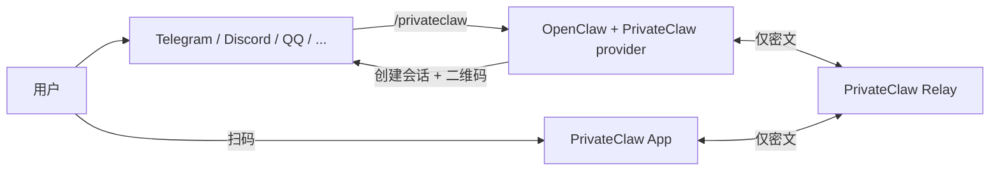
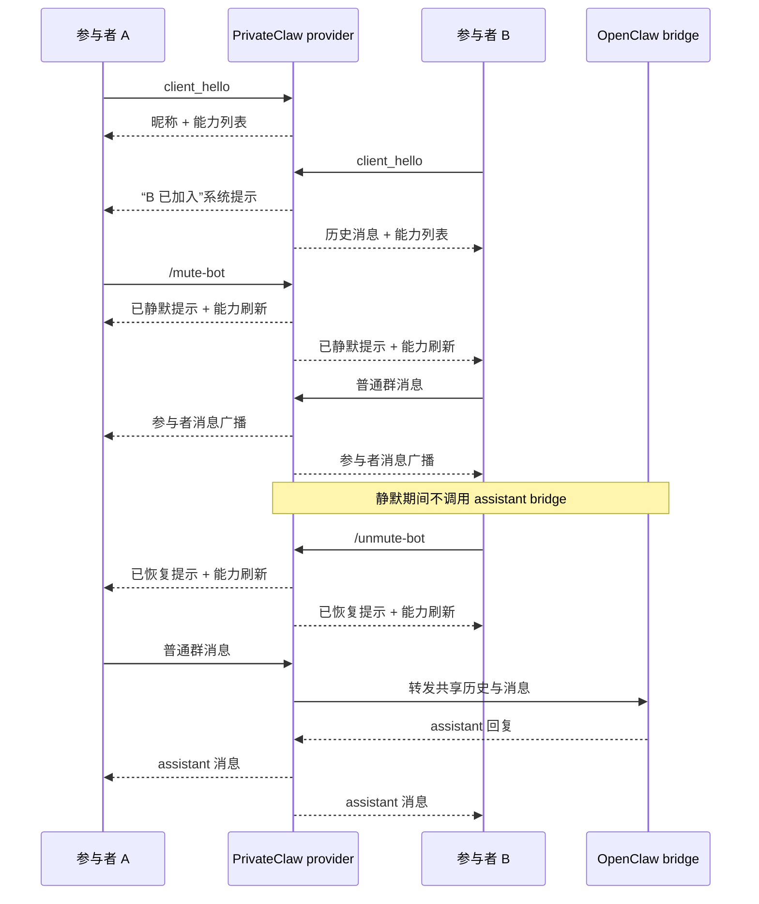

# PrivateClaw

[English README](./README.md)

> ## Railway 一键部署 Relay
>
> [](https://railway.com/?referralCode=V6e2VV)
>
> 点击上面的入口即可快速把 PrivateClaw relay 部署到 Railway。

PrivateClaw 是一个围绕 OpenClaw 构建的轻量级端到端加密私有会话方案：用户先在公开机器人渠道中触发 `/privateclaw`，然后通过一次性二维码切换到 PrivateClaw App 中继续对话；中继只负责转发密文，不可见明文内容。

默认会话是单人私聊模式；如果显式启用群聊模式，同一个邀请也可以被多个 App 端加入，并在聊天界面中以稳定昵称区分不同参与者。

Provider 生成的邀请说明、`openclaw privateclaw pair` 的终端输出，以及内置 PrivateClaw slash command 描述现在都会同时输出中英文，便于在不同语言上下文里操作同一个会话。

欢迎加入 Telegram 交流群：[PrivateClaw Telegram 群](https://t.me/+W3RUKxEO9kIxMmZl)

移动端下载入口：

- iOS App Store（YourClaw）：https://apps.apple.com/us/app/yourclaw/id6760531637
- Android 封闭 alpha 测试群组（Google Group）：https://groups.google.com/g/gg-studio-ai-products
- Android 封闭 alpha 测试地址（Google Play）：https://play.google.com/store/apps/details?id=gg.ai.privateclaw

请注意：Android 的封闭 alpha 测试只有在你先加入上面的 Google Group 之后，Google Play 才会允许你参与。

仓库包含：

- `services/relay-server`：盲转发的 WebSocket 中继服务源码，发布到 npm 后的包名是 `@privateclaw/privateclaw-relay`
- `packages/privateclaw-provider`：发布到 npm 的 OpenClaw provider / plugin，包名为 `@privateclaw/privateclaw`
- `packages/privateclaw-protocol`：共享的邀请、加密信封与控制消息协议
- `apps/privateclaw_app`：Flutter 移动端应用

## 架构概览



1. Provider 连接到 relay 的 `/ws/provider`。
2. 用户在现有 OpenClaw 渠道里触发 `/privateclaw`。
3. Provider 在本地生成会话密钥，向 relay 申请会话 ID，并返回二维码邀请。
4. App 扫码后连接 `/ws/app?sessionId=...`。
5. App 与 provider 使用 AES-256-GCM 交换加密消息。
6. Relay 只看见会话元数据和密文，无法读取对话内容。

在可选群聊模式下，同一个会话会保留一份共享的 OpenClaw 对话上下文；provider 会为每个 App 安装分配一个简短昵称，并把参与者消息广播给所有已连接成员。

## 群聊生命周期与机器人控制



## 生产部署

PrivateClaw 的公共生产 relay 是：

```text
https://relay.privateclaw.us
```

仓库里的源码默认值已经切到这个地址，所以生产环境默认可以直接使用；只有当你想覆盖成自己的 relay 时，才需要额外写 `relayBaseUrl` 配置。

### 1. 通过 npm 把 provider 安装到 OpenClaw

安装或运行 PrivateClaw 这个 OpenClaw 插件的机器，请使用 Node.js 22 或更高版本。

```bash
npm pack @privateclaw/privateclaw@latest
openclaw plugins install ./privateclaw-privateclaw-*.tgz
openclaw plugins enable privateclaw
```

最近的 OpenClaw 对裸 npm spec 会先查 ClawHub。这意味着 `openclaw plugins install @privateclaw/privateclaw` 实际跟随的是 ClawHub 当前发布的最新版，它可能会比 npm 上最新的 patch 版本慢一步。如果你想立刻强制使用 npm 上最新的包，就先把 npm 包打成本地归档，再把生成的 `.tgz` 装进 OpenClaw。

如果你直接使用默认公共 relay `https://relay.privateclaw.us`，那么 `relayBaseUrl` 这一步是可选的，可以跳过。只有在你想把 PrivateClaw 的默认 relay 改成自己的部署时，才需要额外执行 `openclaw config set plugins.entries.privateclaw.config.relayBaseUrl ...`。如果只是某一次邀请想临时改 relay，现在也可以直接在命令里覆盖，而不用改持久配置。

PrivateClaw 是一个 OpenClaw 插件命令提供者，不是内置聊天传输 channel。因此**不要**使用 `openclaw channels add privateclaw`。正确方式是：

- 用 `openclaw plugins install ...` 安装插件
- 用 `openclaw plugins enable privateclaw` 启用插件
- 用 `plugins.entries.privateclaw.config` 进行配置

如果你不是要安装 npm 已发布版本，而是想立刻使用 GitHub 仓库里的最新代码，可以先打包工作区再安装 `.tgz`：

```bash
TARBALL="$(npm pack --workspace @privateclaw/privateclaw | tail -n 1)"
openclaw plugins install "./${TARBALL}"
openclaw plugins enable privateclaw
```

执行完 `openclaw plugins install`、`openclaw plugins enable`，或者任何 `openclaw config set plugins.entries.privateclaw.config...` 改动后，在测试前都要重启正在运行的 OpenClaw gateway / service，让它重新加载插件和配置。实际操作上，就是重启正在跑的 `openclaw start` 进程，或者你用来托管 gateway 的 service。

如果当前机器已经装好了 `openclaw`，现在最快的本地引导方式是直接运行独立 setup 向导：

```bash
npx -y @privateclaw/privateclaw@latest
```

这个 `npx` 独立流程会检查本机 OpenClaw、自动安装或更新插件、启用插件、重启 gateway，然后立刻开始配对。过程中会提示你选择单聊还是群聊，以及这些会话时长预设之一：`30m`、`2h`、`4h`、`8h`、`24h`、`1w`、`1mo`、`1y`、`permanent`（实际表示 `100 年`）。由于它直接使用 npm 包本身，所以如果 npm 上已经有比 ClawHub 更新的 patch，它也是最快拿到最新 patch 的方式。

如果你想把这些选择提前写死，也可以这样运行：

```bash
npx -y @privateclaw/privateclaw@latest setup --group --duration 24h --open
```

如果你想让群聊会话更像“有一个会主动搭话的机器人参与者”，也可以额外打开：

```bash
openclaw config set plugins.entries.privateclaw.config.botMode true
```

打开后，provider 会在新加入成员安静大约 10 分钟时主动打招呼，并且在群聊大约 20 分钟没有新消息时主动发一条轻量的重新活跃消息。`/mute-bot` 和 `/unmute-bot` 也会一并暂停或恢复这些主动消息。

### 2. 选择如何启动会话

#### 方式 A：通过已有 OpenClaw 聊天渠道触发

先添加一个普通聊天渠道，例如 Telegram：

```bash
openclaw channels add --channel telegram --token <token>
```

然后在该渠道里发送 `/privateclaw`，再用 App 扫描返回的二维码。

安全提示：邀请二维码 / `privateclaw://connect?payload=...` 本身就携带这次会话的一次性 session key。只要有人能扫码或拿到这段邀请链接，就能在过期前加入会话，因此请只在当面场景或你信任的渠道里分享。

如果你想开启加密群聊模式，可以发送 `/privateclaw group`；这样同一个会话允许多个 App 客户端加入，并共享同一段 OpenClaw 对话上下文。参与者在会话有效期内离开后也可以重新加入；任意已连接参与者都可以用 `/session-qr` 重新分享当前会话二维码；当剩余时间少于 30 分钟时，provider 会提醒大家运行 `/renew-session`。群聊中任意参与者也可以用 `/mute-bot` / `/unmute-bot` 暂停或恢复 assistant 参与讨论。

如果只是这一张邀请码想临时走别的 relay，可以直接把 relay 写在 slash 命令里，这两种形式都支持：

```text
/privateclaw relay=https://your-relay.example.com
/privateclaw group --relay https://your-relay.example.com
```

现在移动 App 和网页聊天客户端在遇到“非默认 relay”的二维码或邀请时，都会先弹出确认警告再继续连接。

如果你使用官方默认 relay `https://relay.privateclaw.us`，官方分发的 App 才会直接具备现成的消息推送能力。若改用自定义 relay，则需要你把 relay 侧和 App 构建一起接入你自己的 Firebase / FCM 账号与凭据。

##### 渠道二维码投递兼容性

当 `/privateclaw` 通过已有 OpenClaw 聊天渠道回配对二维码时，真正受约束的是该渠道的出站 `ReplyPayload`（`text` 加 `mediaUrl` / `mediaUrls`），而不是 provider 内部的附件模型。

- `discord`、`telegram`、`slack`、`signal`、`imessage`、`bluebubbles`、`mattermost`、`msteams`、`matrix`、`googlechat`、`feishu`、`whatsapp`、`line`、`zalouser` 这类富媒体渠道，通常可以直接把生成好的二维码作为 `mediaUrl` 发出去。
- `qqbot` 仍然兼容旧的 `<qqimg>...</qqimg>` 内联标签，但当前 gateway 也已经会消费结构化的 `mediaUrl` / `mediaUrls`，所以它不再是“只能吃标签”的特殊渠道。
- `zalo`、`tlon`、`synology-chat` 更偏向 URL 模式：它们期待的是可访问的 HTTP(S) 图片地址，而不是本地 PNG 路径。
- `irc`、`nextcloud-talk`、`twitch` 只会退化成文本链接；`nostr` 当前则直接声明 `media: false`。因此这些渠道一定要在文字里同时带上原始 invite URI，不能只依赖二维码图片。

为了跨渠道稳妥起见，建议始终在公告文字里保留 invite URI，即便同时附带了二维码图片。

#### 方式 B：直接用 OpenClaw CLI 本地起配对会话

如果你不想借助另一个聊天工具，现在最省事的路径是直接在已经装好 OpenClaw 的机器上运行 `npx -y @privateclaw/privateclaw@latest`。这个独立向导会先把本地插件安装/启用好，再替你开始配对。它也直接跟随 npm，所以往往会比 `openclaw plugins install @privateclaw/privateclaw` 更早拿到新的 patch。

当插件已经安装并启用后，先重启正在运行的 OpenClaw gateway / service，让它重新加载扩展。重启完成后，gateway 现在会主动拉起内部的 PrivateClaw `plugin-service`，因此 `openclaw privateclaw pair` 不再依赖“先去别的聊天渠道里跑一次 `/privateclaw` 预热插件”。随后，下面这些共享的会话管理命令会出现在 `openclaw privateclaw` 里；独立 npm 二进制 `privateclaw-provider <subcommand>` 也提供同一组共享命令：

| 命令 | 用途 | 说明 |
| --- | --- | --- |
| `openclaw privateclaw pair` | 创建一个本地 PrivateClaw 会话，并在终端里渲染配对二维码。 | 默认打印完二维码后就返回 shell，同时 provider 会在后台 daemon 中把会话维持到过期。需要临时覆盖 relay 时，可直接追加 `--relay <url>`。 |
| `openclaw privateclaw sessions` | 列出当前由本地管理的活动会话。 | 输出包含总会话数，以及每个会话的 `type`、`participants`、`state`、`expires`、`host` 和可选的 `label`。`host` 目前可能是 `plugin-service`、`pair-foreground` 或 `pair-daemon`。 |
| `openclaw privateclaw sessions follow <sessionId>` | 跟随查看某个本地托管会话的 OpenClaw 日志。 | 这个命令会持续输出 OpenClaw 写入的 session JSONL，方便你实时看 agent 侧执行，同时把 provider 自己的日志留在当前终端里。 |
| `openclaw privateclaw sessions qr <sessionId>` | 重新打印某个当前活动会话的二维码。 | 默认会直接在终端里渲染二维码；加上 `--open` 会同时打开本地浏览器预览页；加上 `--notify` 会把同一张二维码作为临时 assistant 消息发回这个会话当前在线的所有参与者。 |
| `openclaw privateclaw sessions kill <sessionId>` | 终止一个当前由本地管理的会话。 | 在当前版本 host 上，它会只关闭目标会话；如果会话仍由较旧的前台/后台 host 托管、还不支持单会话关闭，则会回退为终止那个 legacy host 进程。 |
| `openclaw privateclaw sessions killall` | 终止全部由后台 daemon 托管的会话。 | 这个命令只会清理 `pair-daemon` 会话，不会影响前台 host 或 plugin-service 会话。独立二进制也提供同样的简写：`privateclaw-provider killall`。 |
| `openclaw privateclaw kick <sessionId> <appId>` | 从群聊会话中移除一个参与者。 | 这会关闭该 app 当前的 relay 连接，并阻止同一个 `appId` 在当前会话中重新加入。 |

`pair` 支持这些公开参数：

| 参数 | 作用 |
| --- | --- |
| `--ttl-ms <ms>` | 覆盖会话 TTL，默认仍是 24 小时。 |
| `--label <label>` | 给 relay 侧会话附加一个可选标签，之后也会显示在会话管理输出中。 |
| `--relay <url>` | 只为这一次命令临时覆盖 relay base URL，不会修改插件配置。 |
| `--group` | 允许多个 PrivateClaw App 客户端加入同一个会话。 |
| `--print-only` | 只打印邀请链接和二维码后立即退出；同时也会关闭这个会话，不会继续保持它存活。 |
| `--open` | 为生成的二维码打开一个本地浏览器预览页。 |
| `--foreground` | 把会话留在当前终端前台，直到会话结束或你按 `Ctrl+C`。在支持的运行时里，还可以按 `Ctrl+D` 把当前活跃会话无缝切换到后台 daemon。 |
| `--verbose` | 输出更详细的 provider / bridge 调试日志。实际排查时建议和 `--foreground` 搭配使用，这样额外日志会直接留在当前终端里。 |

例如，想直接从 CLI 启动一个群聊会话，并先留在前台：

```bash
npx -y @privateclaw/privateclaw@latest
npx -y @privateclaw/privateclaw@latest setup --group --duration permanent --open
openclaw privateclaw pair --group --foreground
openclaw privateclaw pair --foreground --verbose
openclaw privateclaw pair --relay https://your-relay.example.com
openclaw privateclaw sessions follow <sessionId>
openclaw privateclaw sessions qr <sessionId> --notify
openclaw privateclaw sessions kill <sessionId>
openclaw privateclaw sessions killall
privateclaw-provider sessions qr <sessionId> --open
privateclaw-provider sessions follow <sessionId>
privateclaw-provider killall
privateclaw-provider pair --relay https://your-relay.example.com --foreground
privateclaw-provider pair --foreground --verbose
```

后台 daemon 会话在 OpenClaw 主进程重启后仍可能继续存活。可以用 `openclaw privateclaw sessions` 或 `privateclaw-provider sessions` 查看它们；想手动结束单个会话时用 `sessions kill <sessionId>`，想一次性清空全部后台 daemon 会话时用 `sessions killall`（或者独立二进制的 `privateclaw-provider killall`）。

### 语音 STT / ASR

当用户发送语音附件时，PrivateClaw 现在会优先在 provider 侧完成转录，再把结果送进正常的 OpenClaw 文本对话流程。

当前运行时的优先级是：

1. 主机上已安装 `openai-whisper` 时，优先调用本地 `whisper` CLI
2. 使用 OpenClaw 默认音频模型配置或 `PRIVATECLAW_STT_*` 覆盖得到的 provider 侧 direct STT
3. 最后才回退到 bridge 的 `transcribeAudioAttachments(...)` 路径

如果 provider 侧某一层失败，PrivateClaw 会明确记录回退日志，然后继续尝试下一层，而不是立刻让整个语音回合失败。现场排查时，建议使用 `openclaw privateclaw pair --foreground --verbose` 或 `privateclaw-provider pair --foreground --verbose`。

如果你希望使用 OpenClaw 配置里的 provider 侧网络 STT，可以直接配置默认音频模型，例如：

```bash
openclaw config set tools.media.audio.models '[{"baseUrl":"http://127.0.0.1:8090","model":"whisper-1","headers":{"Authorization":"Bearer local"}}]' --strict-json
openclaw config validate
```

本地 `whisper` 还支持这些可选环境变量覆盖：

- `PRIVATECLAW_WHISPER_BIN`
- `PRIVATECLAW_WHISPER_MODEL`
- `PRIVATECLAW_WHISPER_LANGUAGE`
- `PRIVATECLAW_WHISPER_DEVICE`
- `PRIVATECLAW_WHISPER_MODEL_DIR`

如果你希望 provider 在群聊里更像一个会主动参与的成员，可以开启 bot mode：

```bash
openclaw config set plugins.entries.privateclaw.config.botMode true
```

开启 `botMode` 之后，群聊会额外有两种主动行为：

- 新加入的成员如果大约 10 分钟都没有发言，会收到一条主动问候
- 群里如果大约 20 分钟都没有新的用户消息，会收到一条主动活跃气氛的消息

群聊静默后的这条主动消息现在会从内置的 200 个脑洞话题里随机挑选一个切入点，并尽量避免同一个 session 连续两次抽到相同话题。

这两种行为都走和普通 assistant 回复相同的 upstream bridge / OpenClaw agent 路径，`/mute-bot` 和 `/unmute-bot` 也会暂停或恢复这些主动消息。

如果需要更细的调优，还可以使用：

- plugin config 覆盖项：`botModeSilentJoinDelayMs`、`botModeIdleDelayMs`
- 环境变量：`PRIVATECLAW_BOT_MODE`、`PRIVATECLAW_BOT_MODE_SILENT_JOIN_DELAY_MS`、`PRIVATECLAW_BOT_MODE_IDLE_DELAY_MS`

这两个超时都使用毫秒。默认值分别是：

- `600000`：静默入群问候（10 分钟）
- `1200000`：群聊静默后的主动热场（20 分钟）

如果 plugin config 和环境变量同时设置，以 plugin config 为准。

### 3. 运行 App

```bash
cd apps/privateclaw_app
flutter run
```

随后扫描 `/privateclaw` 返回的二维码，或者扫描 `openclaw privateclaw pair` 在终端里打印的二维码，即可进入私有会话。
会话真正连上之后，App 的会话面板还会显示当前连接到的 relay 服务器，方便用户确认自己到底接入了哪个 relay 节点。
如果扫码或粘贴的是“非默认 relay”的邀请，App 现在会先弹出确认警告，再决定是否继续连接。

如果二维码来自 `/privateclaw group` 或 `openclaw privateclaw pair --group`，App 会显示参与者昵称，并把自己的稳定身份一并带入该群聊会话。会话进行中时，参与者仍然可以使用 `/session-qr` 重新分享当前二维码；本地操作者也可以用 `openclaw privateclaw sessions qr <sessionId>` 或 `privateclaw-provider sessions qr <sessionId>` 在终端重新打印，必要时再配合 `--notify` 发回群里。

在模拟器、桌面或剪贴板调试场景中，也可以直接粘贴原始 `privateclaw://connect?...` 链接，或者粘贴完整的 `邀请链接 / Invite URI: ...` 文本。

## 开发与测试部署

### 1. 安装依赖

```bash
npm install
cd apps/privateclaw_app && flutter pub get
cd ../..
```

如果你希望启用仓库内置的 Git hook，防止把本地 Firebase、relay 或签名凭据误提交 / 误推送出去，请在 clone 后执行一次 `npm run hooks:install`。

### 2. 启动本地 relay

本地 Docker 开发：

```bash
npm run docker:relay
```

这个脚本在 `services/relay-server/.env` 存在时会自动加载其中的本地忽略配置；如果你要在本机调试完整的 wake push，推荐把自己的 FCM relay 凭据放在这个文件里。

或者直接以 Node.js 方式运行：

```bash
npm run dev:relay
npx @privateclaw/privateclaw-relay
privateclaw-relay --web
privateclaw-relay --public cloudflare
privateclaw-relay --public tailscale
```

发布后的 relay npm 包会暴露 `privateclaw-relay` 这个二进制，因此不克隆整个仓库也可以直接启动本地 relay。加上 `--public cloudflare` 会启动一个临时的 Cloudflare quick tunnel；加上 `--public tailscale` 会为当前 relay 端口启用 Tailscale Funnel。如果默认本地端口 `8787` 已经被占用，CLI 会自动顺延到下一个可用端口，并打印最终监听地址。
加上 `--web` 之后，同一个进程还会把 PrivateClaw 网站一并托管出来：首页在 `/`，网页聊天入口在 `/chat/`，而 relay 的 WebSocket 端点仍然保持在 `/ws/*` 下，不会互相冲突。
如果本机缺少 `tailscale` 或 `cloudflared`，CLI 现在会按操作系统打印更友好的安装命令；在支持的交互式终端里，还可以继续询问是否直接安装/配置，然后自动重试启动公网 tunnel。
拿到公网 relay URL 之后，CLI 现在还会直接打印 OpenClaw + PrivateClaw provider 的配置命令。如果本机已经安装了 `openclaw`，它还可以继续询问是否直接帮你执行本地 provider 的安装或更新 / 启用 / 配置，自动重启 gateway，确认 `privateclaw` 命令已经注册好，然后可选地直接发起一个新的群配对。配合 `--web` 时，它还可以直接打开已经带好 invite 的网页聊天地址。

### 3. 把本地 provider 仓库联到 OpenClaw

```bash
openclaw plugins install --link ./packages/privateclaw-provider
openclaw plugins enable privateclaw
openclaw config set plugins.entries.privateclaw.config.relayBaseUrl ws://127.0.0.1:8787
```

因为这个流程同时变更了已安装插件和 relay 目标地址，所以开始测试前也需要重启正在运行的 OpenClaw gateway / service。

如果你希望从一个 relay base URL 推导 provider / app 两个 WebSocket 地址，也可以直接使用导出的辅助函数：

```ts
import { resolveRelayEndpoints } from "@privateclaw/privateclaw";

const relay = resolveRelayEndpoints("ws://127.0.0.1:8787");
```

## 自建 relay

如果你使用自己的 relay，而不是 `https://relay.privateclaw.us`，记得执行 `openclaw config set plugins.entries.privateclaw.config.relayBaseUrl <你的 relay base URL>` 把 OpenClaw 指过去，然后重启正在运行的 OpenClaw gateway / service。Relay 本体依然保持轻量，但在设置 `PRIVATECLAW_REDIS_URL` / `REDIS_URL` 之后，会把 session 元数据、密文缓冲和多实例协调都放到共享 Redis 里。

### Docker Compose

```bash
docker compose up --build relay
```

如果希望本地 relay 具备 wake push 能力，可以先把 `services/relay-server/.env.example` 复制成被 Git 忽略的 `services/relay-server/.env`，再填入你自己的 FCM 凭据。公共仓库的 clone/fork 即使没有这个文件也能启动 relay，只是不会启用推送唤醒。

启用可选 Redis：

```bash
PRIVATECLAW_REDIS_URL=redis://redis:6379 docker compose --profile redis up --build
```

启用共享 Redis 之后，relay 重启不会丢失已发出的二维码 session，而且多个 relay 实例也可以在负载均衡后共享同一批 session。未配置 Redis 时，session 仍然只存在内存里。

### Railway 一键部署

仓库根目录现在直接提供了两套 Railway 配置：

- `railway.toml` + `Dockerfile.multiarch`：独立 relay 容器
- `railway.redis.toml` + `Dockerfile.multiarch.redis`：同容器内自启 Redis 的 relay 容器

Relay 现在同时响应 `/healthz` 和 `/api/health`，并且在未设置 `PRIVATECLAW_RELAY_PORT` 时会自动读取 Railway 注入的 `PORT`。
Railway 镜像里不会再把 `PRIVATECLAW_RELAY_PORT` 写死到容器环境中，这样运行时才能正确监听 Railway 分配的 `PORT`。

独立容器部署：

1. 在 Railway 中从本仓库创建一个服务。
2. 保持根目录默认的 `railway.toml` 不变。
3. 直接部署。

如果你希望 Railway 上的 relay 支持重启恢复或多实例负载均衡，请给 relay 服务绑定一个共享 Redis，并设置 `PRIVATECLAW_REDIS_URL` 或 `REDIS_URL`。

同容器 Redis 部署：

1. 把 `railway.redis.toml` 覆盖为 `railway.toml`，或者在 Railway 中把 Dockerfile 路径改成 `Dockerfile.multiarch.redis`。
2. 直接部署。

这个带 Redis 的镜像会在 relay 容器内把 Redis 启在 `127.0.0.1:6379`，并自动设置 `PRIVATECLAW_REDIS_URL`。它适合单实例部署，但**不适合**多实例高可用，因为每个容器里的内置 Redis 都是彼此独立的。

### Relay 独立部署分支

如果 Railway 上的 relay 服务已经固定监听 `railway-relay` 分支，那么你可以在不切换当前工作区的情况下，把已经提交好的 relay 改动一键同步过去：

```bash
npm run relay:promote
```

这个命令会在临时 `git worktree` 里检出指定来源提交，然后把 `railway-relay` 强制同步到那个完整提交，并同时推送到 `origin` 和 `upstream`。

如果你想把 `railway-relay` 同步到某个指定提交，而不是默认使用当前 `HEAD`：

```bash
npm run relay:promote -- <commit>
```

记得在 Railway 控制台里把 relay 服务的 Source Branch 设成 `railway-relay`；日常 app、site、provider 开发继续走 `main`。

### GitHub Actions 构建的镜像

仓库内的 `.github/workflows/relay-image.yml` 会在 `main`、版本 tag 和手动触发时构建并发布多架构 relay 镜像到 GHCR：

```bash
docker run --rm \
  -p 8787:8787 \
  -e PRIVATECLAW_RELAY_HOST=0.0.0.0 \
  ghcr.io/topcheer/privateclaw-relay:main
```

### GitHub Actions 构建的 app 发布产物

仓库现在还包含 `.github/workflows/app-release.yml`，用于在 GitHub 托管 runner 上打包桌面端和移动端 app 产物。

- 推送 `app-v*` tag（例如 `app-v0.1.12`）时，会自动构建产物并发布一个 GitHub Release。
- 也可以手动触发这个 workflow，只构建产物而不发布 Release，并且可选覆盖自动解析出来的 `build name` / `build number`。
- 桌面端产物格式：
  - Windows：`.zip`（已验证 `x64`；GitHub-hosted `arm64` 当前暂不发布）
  - Windows Store：用于手工上传到 Partner Center 的已验证未签名 `.msix`（`x64`）
  - macOS：`.dmg`（`x64`、`arm64`）
  - Linux：`.tar.gz`（已验证 `x64`、`arm64`）
- 移动端产物格式：
  - Android：release `.aab`，以及 `arm64` / `x64` 的拆分 `.apk`
  - iOS：未签名的 release `.ipa`，以及对应的 `.xcarchive` 归档
- 仓库还包含 `.github/workflows/app-arm-probe.yml`，用于手动验证 ARM GitHub-hosted runner。它会在 `ubuntu-24.04-arm` 和 `windows-11-arm` 上运行，先记录指定 Flutter 版本是否真的发布了对应主机的官方 `arm64` 桌面 SDK，再在 Flutter 安装成功时尝试真实的桌面构建。
- 示例：

```bash
gh workflow run app-arm-probe.yml \
  -f flutter_version=3.41.6 \
  -f flutter_channel=stable \
  -f flutter_install_method=flutter-action \
  -f build_mode=release \
  -f run_desktop_build=true \
  -f fail_on_probe_failure=false
```

如果想验证 `subosito/flutter-action` issue `#345` 里讨论的 clone 方案，可以把 `flutter_install_method` 改成 `git-clone`。这个 probe workflow 会改为从 GitHub 浅克隆 Flutter、加入 `PATH`，再先跑 `flutter doctor` 做自举，然后才继续尝试桌面构建。

这样 app 发布使用 `app-v*` tag，而 provider / relay 现有的 npm 发布流程仍继续使用 `v*` tag，互不干扰。

当前仓库固定使用 Flutter `3.41.6`，而它的官方 release manifest 仍然只提供 Linux / Windows 的 `x64` 桌面 SDK 归档。在 `ubuntu-24.04-arm` 上，GitHub 的 app release workflow 会使用已经验证过的 clone-and-bootstrap 方案，并继续发布真实的 Linux `arm64` 产物；但在 `windows-11-arm` 上，当前 Flutter 工具链仍会回退到 `windows-x64` 输出，所以 Windows `arm64` 桌面产物当前暂不发布，已验证可上传的 Windows Store 路径也仍然是 x64 包。macOS 双架构仍继续走正常的预构建 SDK 路径。

### 发布到 npm 的 relay 包

Relay 也可以直接作为 npm 包使用，包名是 `@privateclaw/privateclaw-relay`：

```bash
npm install -g @privateclaw/privateclaw-relay
privateclaw-relay
privateclaw-relay --public cloudflare
privateclaw-relay --public tailscale
```

`--public cloudflare` 依赖本机已安装 `cloudflared`，会创建临时的 quick tunnel。`--public tailscale` 依赖本机已安装并已登录的 `tailscale`，同时要求你的 tailnet 已启用 Funnel。如果本地启动时 `8787` 已被占用，`privateclaw-relay` 会自动尝试下一个可用端口。
如果缺少对应的 tunnel CLI，`privateclaw-relay` 现在会给出按操作系统区分的安装提示，并在支持的平台上提供交互式安装流程。

### Relay 环境变量

| 变量 | 默认值 | 说明 |
| --- | --- | --- |
| `PRIVATECLAW_RELAY_HOST` | `127.0.0.1` | 监听地址 |
| `PRIVATECLAW_RELAY_PORT` | `8787` | 服务端口；未设置时会回退到 Railway 的 `PORT` |
| `PRIVATECLAW_SESSION_TTL_MS` | `900000` | 会话过期时间 |
| `PRIVATECLAW_FRAME_CACHE_SIZE` | `25` | 双向密文缓冲条数 |
| `PRIVATECLAW_RELAY_INSTANCE_ID` | `RAILWAY_REPLICA_ID` 或自动生成 | 多实例 relay 的可选固定节点 ID，便于日志和节点交接 |
| `PRIVATECLAW_REDIS_URL` | 未设置 | 共享 Redis 地址；开启后用于 session 持久化、分布式密文缓冲和多实例协调 |
| `REDIS_URL` | 未设置 | `PRIVATECLAW_REDIS_URL` 未设置时使用的别名 |

Relay 同时暴露 `/healthz` 和 `/api/health` 用于健康检查。

## 开发

常用命令：

```bash
npm run build
npm test
npm run dev:relay
npm run demo:provider
```

Flutter：

```bash
cd apps/privateclaw_app
flutter test
flutter build apk --debug
flutter build ios --simulator
```

如果修改了 relay 打包相关内容，建议额外执行：

```bash
docker compose build relay
```

## 文档说明

仓库根目录下的 `OPENCLAW_*` 文档保留了早期调研和集成过程，适合追溯设计背景；当前以 `README.md`、本文件、`packages/privateclaw-provider/README.md`、`apps/privateclaw_app/README.md` 以及最新源码为准。

## 已发布产物

- npm provider 包：`@privateclaw/privateclaw`
- npm protocol 包：`@privateclaw/protocol`
- npm relay 包：`@privateclaw/privateclaw-relay`
- relay 容器镜像：`ghcr.io/topcheer/privateclaw-relay`

维护说明：`@privateclaw/privateclaw` 在插件安装阶段会继续拉取 `@privateclaw/protocol`；relay 虽然独立，但也和 provider 一样通过版本 tag 的 npm workflow 一起发布。因此发布时建议按 `protocol -> relay -> provider` 的顺序检查：

```bash
npm run publish:npm:dry-run
npm run publish:npm
```
