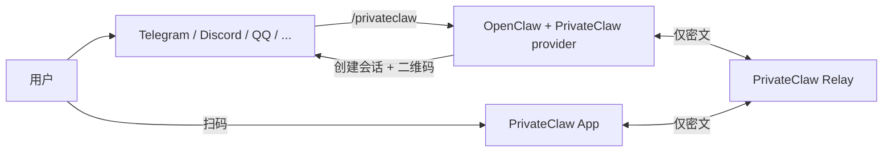
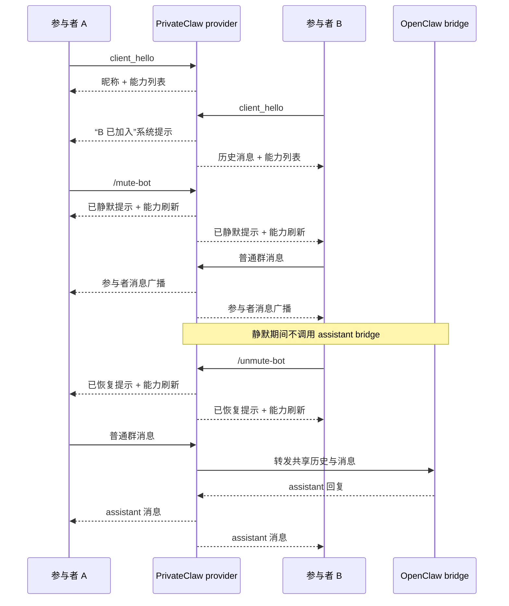

# PrivateClaw

[English README](./README.md)

PrivateClaw 是一个围绕 OpenClaw 构建的轻量级端到端加密私有会话方案：用户先在公开机器人渠道中触发 `/privateclaw`，然后通过一次性二维码切换到 PrivateClaw App 中继续对话；中继只负责转发密文，不可见明文内容。

默认会话是单人私聊模式；如果显式启用群聊模式，同一个邀请也可以被多个 App 端加入，并在聊天界面中以稳定昵称区分不同参与者。

Provider 生成的邀请说明、`openclaw privateclaw pair` 的终端输出，以及内置 PrivateClaw slash command 描述现在都会同时输出中英文，便于在不同语言上下文里操作同一个会话。

仓库包含：

- `services/relay-server`：盲转发的 WebSocket 中继服务
- `packages/privateclaw-provider`：发布到 npm 的 OpenClaw provider / plugin，包名为 `@privateclaw/privateclaw`
- `packages/privateclaw-protocol`：共享的邀请、加密信封与控制消息协议
- `apps/privateclaw_app`：Flutter 移动端应用

## 架构概览



1. Provider 连接到 relay 的 `/ws/provider`。
2. 用户在现有 OpenClaw 渠道里触发 `/privateclaw`。
3. Provider 在本地生成会话密钥，向 relay 申请会话 ID，并返回二维码邀请。
4. App 扫码后连接 `/ws/app?sessionId=...`。
5. App 与 provider 使用 AES-256-GCM 交换加密消息。
6. Relay 只看见会话元数据和密文，无法读取对话内容。

在可选群聊模式下，同一个会话会保留一份共享的 OpenClaw 对话上下文；provider 会为每个 App 安装分配一个简短昵称，并把参与者消息广播给所有已连接成员。

## 群聊生命周期与机器人控制



## 快速开始

### 1. 安装依赖

```bash
npm install
cd apps/privateclaw_app && flutter pub get
cd ../..
```

### 2. 启动 relay

本地开发：

```bash
npm run docker:relay
```

或者直接以 Node.js 方式运行：

```bash
npm run dev:relay
```

### 3. 在 OpenClaw 中安装 provider

从 npm 安装：

```bash
openclaw plugins install @privateclaw/privateclaw@latest
openclaw plugins enable privateclaw
openclaw config set plugins.entries.privateclaw.config.relayBaseUrl https://relay.example.com
```

从当前仓库联调：

```bash
openclaw plugins install --link ./packages/privateclaw-provider
openclaw plugins enable privateclaw
```

PrivateClaw 是一个 OpenClaw 插件命令提供者，不是内置的聊天传输 channel。因此**不要**使用 `openclaw channels add privateclaw`。正确方式是：

- 用 `openclaw plugins install ...` 安装插件
- 用 `openclaw plugins enable privateclaw` 启用插件
- 用 `plugins.entries.privateclaw.config` 进行配置

### 4. 选择如何启动会话

#### 方式 A：通过已有 OpenClaw 聊天渠道触发

先添加一个普通聊天渠道，例如 Telegram：

```bash
openclaw channels add --channel telegram --token <token>
```

然后在该渠道里发送 `/privateclaw`，再用 App 扫描返回的二维码。

如果你想开启加密群聊模式，可以发送 `/privateclaw group`；这样同一个会话允许多个 App 客户端加入，并共享同一段 OpenClaw 对话上下文。群聊中任意参与者都可以使用 `/renew-session` 续时，也可以用 `/mute-bot` / `/unmute-bot` 暂停或恢复 assistant 参与讨论。

#### 方式 B：直接用 OpenClaw CLI 本地起配对会话

如果你不想借助另一个聊天工具，可以直接运行：

```bash
openclaw privateclaw pair
```

这个命令会立刻创建会话，并在终端里直接渲染配对二维码；命令会保持运行，直到你按 `Ctrl+C` 停止。

如果想直接从 CLI 启动群聊模式：

```bash
openclaw privateclaw pair --group
```

### 5. 运行 App

```bash
cd apps/privateclaw_app
flutter run
```

随后扫描 `/privateclaw` 返回的二维码，或者扫描 `openclaw privateclaw pair` 在终端里打印的二维码，即可进入私有会话。

如果二维码来自 `/privateclaw group` 或 `openclaw privateclaw pair --group`，App 会显示参与者昵称，并把自己的稳定身份一并带入该群聊会话。

在模拟器、桌面或剪贴板调试场景中，也可以直接粘贴原始 `privateclaw://connect?...` 链接，或者粘贴完整的 `邀请链接 / Invite URI: ...` 文本。

## 自建 relay

### Docker Compose

```bash
docker compose up --build relay
```

启用可选 Redis：

```bash
PRIVATECLAW_REDIS_URL=redis://redis:6379 docker compose --profile redis up --build
```

### GitHub Actions 构建的镜像

仓库内的 `.github/workflows/relay-image.yml` 会在 `main`、版本 tag 和手动触发时构建并发布多架构 relay 镜像到 GHCR：

```bash
docker run --rm \
  -p 8787:8787 \
  -e PRIVATECLAW_RELAY_HOST=0.0.0.0 \
  ghcr.io/topcheer/privateclaw-relay:main
```

### Relay 环境变量

| 变量 | 默认值 | 说明 |
| --- | --- | --- |
| `PRIVATECLAW_RELAY_HOST` | `127.0.0.1` | 监听地址 |
| `PRIVATECLAW_RELAY_PORT` | `8787` | 服务端口 |
| `PRIVATECLAW_SESSION_TTL_MS` | `900000` | 会话过期时间 |
| `PRIVATECLAW_FRAME_CACHE_SIZE` | `25` | 双向密文缓冲条数 |
| `PRIVATECLAW_REDIS_URL` | 未设置 | 可选 Redis 地址 |

Relay 暴露 `/healthz` 用于健康检查。

## 开发

常用命令：

```bash
npm run build
npm test
npm run dev:relay
npm run demo:provider
```

Flutter：

```bash
cd apps/privateclaw_app
flutter test
flutter build apk --debug
flutter build ios --simulator
```

如果修改了 relay 打包相关内容，建议额外执行：

```bash
docker compose build relay
```

## 文档说明

仓库根目录下的 `OPENCLAW_*` 文档保留了早期调研和集成过程，适合追溯设计背景；当前以 `README.md`、本文件、`packages/privateclaw-provider/README.md`、`apps/privateclaw_app/README.md` 以及最新源码为准。
