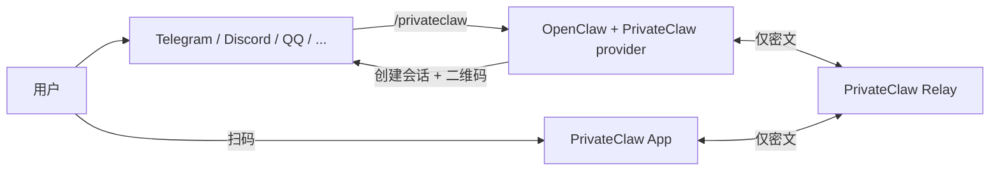
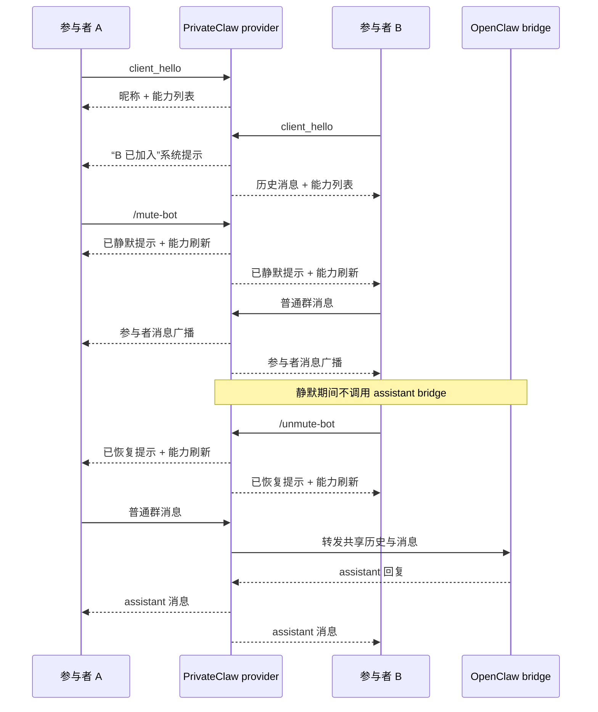

# PrivateClaw

[English README](./README.md)

> ## Railway 一键部署 Relay
>
> [](https://railway.com/?referralCode=V6e2VV)
>
> 点击上面的入口即可快速把 PrivateClaw relay 部署到 Railway。

PrivateClaw 是一个围绕 OpenClaw 构建的轻量级端到端加密私有会话方案：用户先在公开机器人渠道中触发 `/privateclaw`，然后通过一次性二维码切换到 PrivateClaw App 中继续对话；中继只负责转发密文，不可见明文内容。

默认会话是单人私聊模式；如果显式启用群聊模式，同一个邀请也可以被多个 App 端加入，并在聊天界面中以稳定昵称区分不同参与者。

Provider 生成的邀请说明、`openclaw privateclaw pair` 的终端输出，以及内置 PrivateClaw slash command 描述现在都会同时输出中英文，便于在不同语言上下文里操作同一个会话。

仓库包含：

- `services/relay-server`：盲转发的 WebSocket 中继服务
- `packages/privateclaw-provider`：发布到 npm 的 OpenClaw provider / plugin，包名为 `@privateclaw/privateclaw`
- `packages/privateclaw-protocol`：共享的邀请、加密信封与控制消息协议
- `apps/privateclaw_app`：Flutter 移动端应用

## 架构概览



1. Provider 连接到 relay 的 `/ws/provider`。
2. 用户在现有 OpenClaw 渠道里触发 `/privateclaw`。
3. Provider 在本地生成会话密钥，向 relay 申请会话 ID，并返回二维码邀请。
4. App 扫码后连接 `/ws/app?sessionId=...`。
5. App 与 provider 使用 AES-256-GCM 交换加密消息。
6. Relay 只看见会话元数据和密文，无法读取对话内容。

在可选群聊模式下，同一个会话会保留一份共享的 OpenClaw 对话上下文；provider 会为每个 App 安装分配一个简短昵称，并把参与者消息广播给所有已连接成员。

## 群聊生命周期与机器人控制



## 生产部署

PrivateClaw 的公共生产 relay 是：

```text
https://relay.privateclaw.us
```

仓库里的源码默认值已经切到这个地址，所以生产环境默认可以直接使用；只有当你想覆盖成自己的 relay 时，才需要额外写 `relayBaseUrl` 配置。

### 1. 通过 npm 把 provider 安装到 OpenClaw

```bash
openclaw plugins install @privateclaw/privateclaw@latest
openclaw plugins enable privateclaw
```

这里应该使用 `openclaw plugins install`，而且它的帮助信息已经明确说明支持 `path, archive, or npm spec`，所以 `@privateclaw/privateclaw@latest` 是标准的 npm 安装路径，不是只能本地联调时用的命令。

如果你直接使用默认公共 relay `https://relay.privateclaw.us`，那么 `relayBaseUrl` 这一步是可选的，可以跳过。只有在你想把 PrivateClaw 指向自己的 relay 部署时，才需要额外执行 `openclaw config set plugins.entries.privateclaw.config.relayBaseUrl ...`。

PrivateClaw 是一个 OpenClaw 插件命令提供者，不是内置聊天传输 channel。因此**不要**使用 `openclaw channels add privateclaw`。正确方式是：

- 用 `openclaw plugins install ...` 安装插件
- 用 `openclaw plugins enable privateclaw` 启用插件
- 用 `plugins.entries.privateclaw.config` 进行配置

如果 npm 暂时还没追上 GitHub 最新代码，而你又想立即使用最新仓库版本，可以先打包工作区再安装 `.tgz`：

```bash
TARBALL="$(npm pack --workspace @privateclaw/privateclaw | tail -n 1)"
openclaw plugins install "./${TARBALL}"
openclaw plugins enable privateclaw
```

执行完 `openclaw plugins install`、`openclaw plugins enable`，或者任何 `openclaw config set plugins.entries.privateclaw.config...` 改动后，在测试前都要重启正在运行的 OpenClaw gateway / service，让它重新加载插件和配置。实际操作上，就是重启正在跑的 `openclaw start` 进程，或者你用来托管 gateway 的 service。

### 2. 选择如何启动会话

#### 方式 A：通过已有 OpenClaw 聊天渠道触发

先添加一个普通聊天渠道，例如 Telegram：

```bash
openclaw channels add --channel telegram --token <token>
```

然后在该渠道里发送 `/privateclaw`，再用 App 扫描返回的二维码。

如果你想开启加密群聊模式，可以发送 `/privateclaw group`；这样同一个会话允许多个 App 客户端加入，并共享同一段 OpenClaw 对话上下文。群聊中任意参与者都可以使用 `/renew-session` 续时，也可以用 `/mute-bot` / `/unmute-bot` 暂停或恢复 assistant 参与讨论。

#### 方式 B：直接用 OpenClaw CLI 本地起配对会话

如果你不想借助另一个聊天工具，可以直接运行：

```bash
openclaw privateclaw pair
```

这个命令会立刻创建会话，并在终端里直接渲染配对二维码；同时也会把 PNG 文件保存到 OpenClaw 的 media 目录，并把本地路径打印出来，方便那些终端无法稳定显示二维码的场景。如果你想让 PrivateClaw 自动弹出浏览器预览页，可以额外加上 `--open`。命令会保持运行，直到你按 `Ctrl+C` 停止。

如果想直接从 CLI 启动群聊模式：

```bash
openclaw privateclaw pair --group
```

### 3. 运行 App

```bash
cd apps/privateclaw_app
flutter run
```

随后扫描 `/privateclaw` 返回的二维码，或者扫描 `openclaw privateclaw pair` 在终端里打印的二维码，即可进入私有会话。

如果二维码来自 `/privateclaw group` 或 `openclaw privateclaw pair --group`，App 会显示参与者昵称，并把自己的稳定身份一并带入该群聊会话。

在模拟器、桌面或剪贴板调试场景中，也可以直接粘贴原始 `privateclaw://connect?...` 链接，或者粘贴完整的 `邀请链接 / Invite URI: ...` 文本。

## 开发与测试部署

### 1. 安装依赖

```bash
npm install
cd apps/privateclaw_app && flutter pub get
cd ../..
```

### 2. 启动本地 relay

本地 Docker 开发：

```bash
npm run docker:relay
```

这个脚本在 `services/relay-server/.env` 存在时会自动加载其中的本地忽略配置；如果你要在本机调试完整的 wake push，推荐把自己的 FCM relay 凭据放在这个文件里。

或者直接以 Node.js 方式运行：

```bash
npm run dev:relay
```

### 3. 把本地 provider 仓库联到 OpenClaw

```bash
openclaw plugins install --link ./packages/privateclaw-provider
openclaw plugins enable privateclaw
openclaw config set plugins.entries.privateclaw.config.relayBaseUrl ws://127.0.0.1:8787
```

因为这个流程同时变更了已安装插件和 relay 目标地址，所以开始测试前也需要重启正在运行的 OpenClaw gateway / service。

如果你希望从一个 relay base URL 推导 provider / app 两个 WebSocket 地址，也可以直接使用导出的辅助函数：

```ts
import { resolveRelayEndpoints } from "@privateclaw/privateclaw";

const relay = resolveRelayEndpoints("ws://127.0.0.1:8787");
```

## 自建 relay

如果你使用自己的 relay，而不是 `https://relay.privateclaw.us`，记得执行 `openclaw config set plugins.entries.privateclaw.config.relayBaseUrl <你的 relay base URL>` 把 OpenClaw 指过去，然后重启正在运行的 OpenClaw gateway / service。Relay 本体依然保持轻量，但在设置 `PRIVATECLAW_REDIS_URL` / `REDIS_URL` 之后，会把 session 元数据、密文缓冲和多实例协调都放到共享 Redis 里。

### Docker Compose

```bash
docker compose up --build relay
```

如果希望本地 relay 具备 wake push 能力，可以先把 `services/relay-server/.env.example` 复制成被 Git 忽略的 `services/relay-server/.env`，再填入你自己的 FCM 凭据。公共仓库的 clone/fork 即使没有这个文件也能启动 relay，只是不会启用推送唤醒。

启用可选 Redis：

```bash
PRIVATECLAW_REDIS_URL=redis://redis:6379 docker compose --profile redis up --build
```

启用共享 Redis 之后，relay 重启不会丢失已发出的二维码 session，而且多个 relay 实例也可以在负载均衡后共享同一批 session。未配置 Redis 时，session 仍然只存在内存里。

### Railway 一键部署

仓库根目录现在直接提供了两套 Railway 配置：

- `railway.toml` + `Dockerfile.multiarch`：独立 relay 容器
- `railway.redis.toml` + `Dockerfile.multiarch.redis`：同容器内自启 Redis 的 relay 容器

Relay 现在同时响应 `/healthz` 和 `/api/health`，并且在未设置 `PRIVATECLAW_RELAY_PORT` 时会自动读取 Railway 注入的 `PORT`。
Railway 镜像里不会再把 `PRIVATECLAW_RELAY_PORT` 写死到容器环境中，这样运行时才能正确监听 Railway 分配的 `PORT`。

独立容器部署：

1. 在 Railway 中从本仓库创建一个服务。
2. 保持根目录默认的 `railway.toml` 不变。
3. 直接部署。

如果你希望 Railway 上的 relay 支持重启恢复或多实例负载均衡，请给 relay 服务绑定一个共享 Redis，并设置 `PRIVATECLAW_REDIS_URL` 或 `REDIS_URL`。

同容器 Redis 部署：

1. 把 `railway.redis.toml` 覆盖为 `railway.toml`，或者在 Railway 中把 Dockerfile 路径改成 `Dockerfile.multiarch.redis`。
2. 直接部署。

这个带 Redis 的镜像会在 relay 容器内把 Redis 启在 `127.0.0.1:6379`，并自动设置 `PRIVATECLAW_REDIS_URL`。它适合单实例部署，但**不适合**多实例高可用，因为每个容器里的内置 Redis 都是彼此独立的。

### Relay 独立部署分支

如果 Railway 上的 relay 服务已经固定监听 `railway-relay` 分支，那么你可以在不切换当前工作区的情况下，把已经提交好的 relay 改动一键同步过去：

```bash
npm run relay:promote
```

这个命令会在临时 `git worktree` 里把当前 `HEAD` cherry-pick 到 `railway-relay`，然后同时推送到 `origin` 和 `upstream`。

如果你想指定某几个 relay commit，而不是默认使用当前 `HEAD`：

```bash
npm run relay:promote -- <commit> [<commit>...]
```

记得在 Railway 控制台里把 relay 服务的 Source Branch 设成 `railway-relay`；日常 app、site、provider 开发继续走 `main`。

### GitHub Actions 构建的镜像

仓库内的 `.github/workflows/relay-image.yml` 会在 `main`、版本 tag 和手动触发时构建并发布多架构 relay 镜像到 GHCR：

```bash
docker run --rm \
  -p 8787:8787 \
  -e PRIVATECLAW_RELAY_HOST=0.0.0.0 \
  ghcr.io/topcheer/privateclaw-relay:main
```

### Relay 环境变量

| 变量 | 默认值 | 说明 |
| --- | --- | --- |
| `PRIVATECLAW_RELAY_HOST` | `127.0.0.1` | 监听地址 |
| `PRIVATECLAW_RELAY_PORT` | `8787` | 服务端口；未设置时会回退到 Railway 的 `PORT` |
| `PRIVATECLAW_SESSION_TTL_MS` | `900000` | 会话过期时间 |
| `PRIVATECLAW_FRAME_CACHE_SIZE` | `25` | 双向密文缓冲条数 |
| `PRIVATECLAW_RELAY_INSTANCE_ID` | `RAILWAY_REPLICA_ID` 或自动生成 | 多实例 relay 的可选固定节点 ID，便于日志和节点交接 |
| `PRIVATECLAW_REDIS_URL` | 未设置 | 共享 Redis 地址；开启后用于 session 持久化、分布式密文缓冲和多实例协调 |
| `REDIS_URL` | 未设置 | `PRIVATECLAW_REDIS_URL` 未设置时使用的别名 |

Relay 同时暴露 `/healthz` 和 `/api/health` 用于健康检查。

## 开发

常用命令：

```bash
npm run build
npm test
npm run dev:relay
npm run demo:provider
```

Flutter：

```bash
cd apps/privateclaw_app
flutter test
flutter build apk --debug
flutter build ios --simulator
```

如果修改了 relay 打包相关内容，建议额外执行：

```bash
docker compose build relay
```

## 文档说明

仓库根目录下的 `OPENCLAW_*` 文档保留了早期调研和集成过程，适合追溯设计背景；当前以 `README.md`、本文件、`packages/privateclaw-provider/README.md`、`apps/privateclaw_app/README.md` 以及最新源码为准。

## 已发布产物

- npm provider 包：`@privateclaw/privateclaw`
- npm protocol 包：`@privateclaw/protocol`
- relay 容器镜像：`ghcr.io/topcheer/privateclaw-relay`

维护说明：`@privateclaw/privateclaw` 在插件安装阶段会继续拉取 `@privateclaw/protocol`，所以发布时必须先发 protocol，再发 provider：

```bash
npm run publish:npm:dry-run
npm run publish:npm
```
