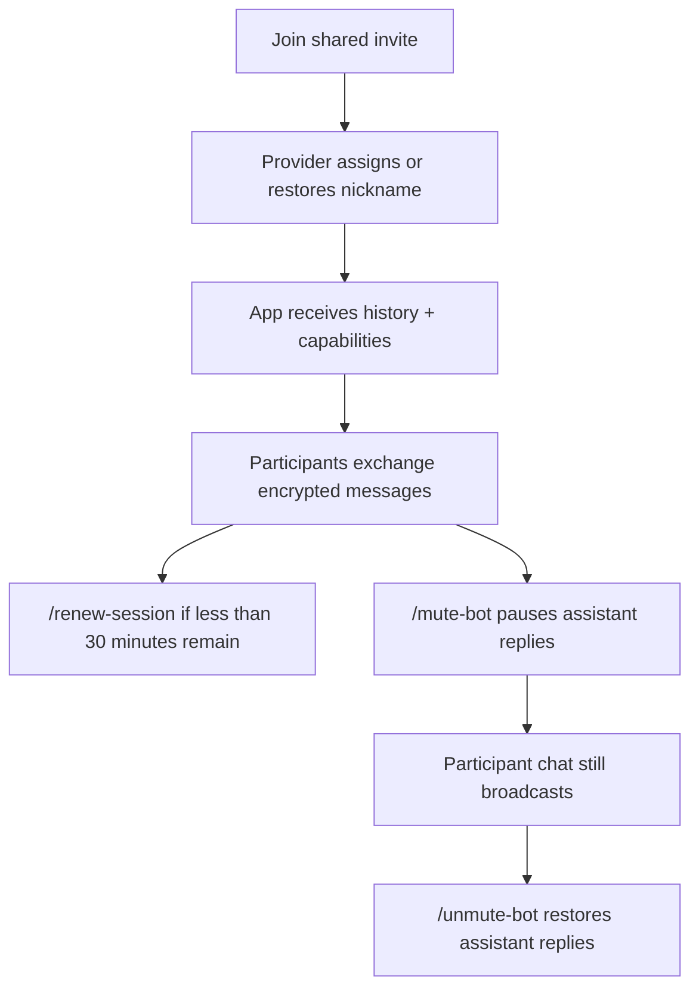

# PrivateClaw App

Flutter client for PrivateClaw secure sessions.

The app pairs by scanning or pasting a one-time invite generated by the OpenClaw provider, then keeps talking to the provider through the encrypted PrivateClaw relay.

## Features

- QR scan and manual invite paste, including full `Invite URI: ...` or `邀请链接 / Invite URI: ...` lines copied from terminal/chat output
- end-to-end encrypted chat over the relay
- persistent per-install app identity with provider-assigned display names
- reconnect and session-renewal handling
- optional group sessions with participant labels plus join/leave system notices
- slash-command sync for `/renew-session` and group-only `/mute-bot` / `/unmute-bot`
- localized UI chrome plus bilingual provider-generated notices
- markdown rendering with best-effort Mermaid support
- image, audio, video, and file attachment rendering
- file upload alongside text messages

## Local development

```bash
flutter pub get
flutter run
```

The app's Firebase push setup is intentionally local-only by default. Keep your own native Firebase files outside Git at:

- `android/app/google-services.json`
- `ios/Runner/GoogleService-Info.plist`

When those files are present, device builds can exercise full push/background wake flows. Without them, the app still builds and runs, but Firebase push stays disabled until you add your own configuration.

To join a normal private session, scan a QR code created by `/privateclaw` or `openclaw privateclaw pair`.
You can also paste the raw `privateclaw://connect?...` link or the full `Invite URI: ...` announcement text.

To join a shared encrypted room, scan a QR code created by `/privateclaw group` or `openclaw privateclaw pair --group`.

## Group behavior



## Validation

```bash
flutter test
flutter build apk --debug
flutter build ios --simulator
```

## Store delivery

- TestFlight: `cd ios && fastlane beta`
- TestFlight external promote: `cd ios && fastlane promote_external`
- App Store metadata only: `cd ios && fastlane metadata`
- App Store review submission: `cd ios && fastlane release`
- Play internal testing: `cd android && fastlane internal`
- Play closed testing promote: `cd android && fastlane promote_closed`
- Play internal -> closed testing pipeline: `cd android && fastlane closed`
- Play metadata only: `cd android && fastlane metadata`

You can also run the same lanes from the repository root:

- `npm run store:version`
- `npm run store:version:shell`
- `npm run store:check`
- `npm run store:check:ggai`
- `npm run ios:testflight`
- `npm run ios:testflight:upload`
- `npm run ios:testflight:external`
- `npm run ios:testflight:ggai`
- `npm run ios:testflight:upload:ggai`
- `npm run ios:testflight:external:ggai`
- `npm run ios:metadata`
- `npm run ios:release`
- `npm run ios:release:upload`
- `npm run ios:release:ggai`
- `npm run ios:release:upload:ggai`
- `npm run android:internal`
- `npm run android:internal:upload`
- `npm run android:closed`
- `npm run android:closed:promote`
- `npm run android:internal:ggai`
- `npm run android:internal:upload:ggai`
- `npm run android:closed:ggai`
- `npm run android:closed:promote:ggai`
- `npm run android:metadata`

Run `npm run store:check` first to verify that the required App Store Connect / Play Console environment variables and credential file paths are available from the current shell.

If you already keep the same signing material in `~/ggai/GGAiDoodle`, the `*:ggai` scripts will auto-load those local values before running the check or upload lane. Override the lookup root with `PRIVATECLAW_GGAIDOODLE_ROOT=/your/GGAiDoodle/path` when needed.

Use the `*:upload` variants when you already have a fresh IPA or AAB on disk and only want to retry the store upload without rebuilding first.

For iOS specifically, `ios:release:upload*` now submits the already-uploaded App Store Connect build identified by `PRIVATECLAW_BUILD_NAME` / `PRIVATECLAW_BUILD_NUMBER` for review instead of re-uploading the IPA. Use `ios:release*` when you need to build and upload a new binary first.

The TestFlight external promote step defaults to the App Store Connect external tester group `ext`. Override `PRIVATECLAW_TESTFLIGHT_EXTERNAL_GROUPS` with a comma-separated list if you need a different target group set. Set `PRIVATECLAW_TESTFLIGHT_NOTIFY_EXTERNAL_TESTERS=true` if you want the promote step to notify testers immediately.

Versioning rules:

- `versionName` / iOS marketing version comes from the `major.minor.patch` part of `pubspec.yaml`.
- `buildNumber` / Android `versionCode` is generated automatically for fresh store builds from the current UTC seconds offset since `2024-01-01T00:00:00Z`, with the `pubspec.yaml` build suffix acting as a floor.
- If you want both platforms to reuse one shared auto-generated build number, export it once with `eval "$(npm run -s store:version:shell)"` before running your iOS and Android store commands.
- Optional overrides: `PRIVATECLAW_BUILD_NAME`, `PRIVATECLAW_BUILD_NUMBER`.

Note: the first Play Console binary upload for a brand-new app still needs to be done manually in the Play Console once before the `internal` lane can be used for follow-up uploads.

If Play responds with `Package not found: gg.ai.privateclaw`, complete the first manual Play Console upload for that package and confirm that the service account tied to your Play JSON key has been granted access to the app.

If Play responds with `The apk has permissions that require a privacy policy set for the app`, add a public HTTPS privacy policy URL in Play Console before retrying the upload. The repository now ships a baseline policy in `PRIVACY.md`.

If the Play app is still in draft state, run the Android upload with `PRIVATECLAW_PLAY_RELEASE_STATUS=draft` so Google accepts the internal release while the app is still a draft.

Play closed testing uses the legacy `alpha` track name in the Google Play API by default. Override it with `PRIVATECLAW_PLAY_CLOSED_TRACK` if your closed track uses a different API name, or change the source track from `internal` with `PRIVATECLAW_PLAY_PROMOTE_FROM_TRACK`.

## Notes

- App name: `PrivateClaw`
- Bundle / package ID: `gg.ai.privateclaw`
- Relay invites use the `privateclaw://connect?...` scheme
- The app stores a stable local `appId` plus the provider-assigned display name so a returning install keeps the same participant identity across reconnects
- Group sessions stay alive when one participant leaves manually; the remaining members see join/leave system notices, and the same invite can be scanned again until the session expires
- The group slash-command picker updates dynamically as the provider toggles between `/mute-bot` and `/unmute-bot`

See the repository root `README.md` for architecture, relay deployment, and OpenClaw provider setup.
