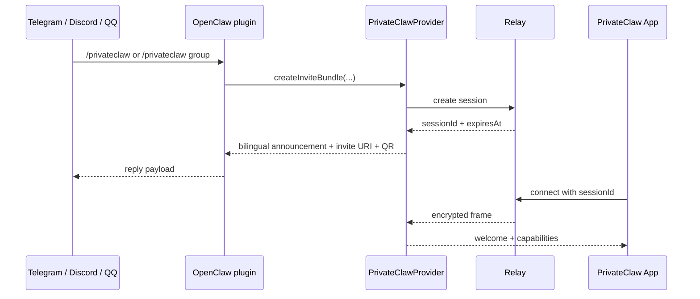

# `@privateclaw/privateclaw`

`@privateclaw/privateclaw` is the npm-publishable runtime behind PrivateClaw sessions.

It is responsible for:

- creating one-time relay sessions,
- optionally turning those sessions into small encrypted group rooms with join/leave presence notices,
- exposing `/renew-session`, `/session-qr`, `/mute-bot`, and `/unmute-bot` as dynamic built-in PrivateClaw commands when appropriate,
- emitting bilingual Chinese + English invite / CLI / command text for the built-in PrivateClaw surfaces,
- generating encrypted invite QR payloads,
- terminating app-side ciphertext,
- forwarding user messages into an upstream bridge,
- and sending assistant replies back through the relay.

Join the community on Telegram: [PrivateClaw Telegram group](https://t.me/+W3RUKxEO9kIxMmZl)

Mobile beta access:

- iOS public beta (TestFlight): https://testflight.apple.com/join/XvgJ9c33
- Android closed alpha tester group: https://groups.google.com/g/gg-studio-ai-products
- Android closed alpha (Google Play): https://play.google.com/store/apps/details?id=gg.ai.privateclaw

For Android closed alpha, Google Play access only opens after the tester joins the Google Group above.

## Provider control flow



## Install

```bash
npm install @privateclaw/privateclaw @privateclaw/protocol
```

The production default relay for this package is:

```text
https://relay.privateclaw.us
```

`openclaw plugins install` accepts a path, archive, or npm package spec. For production, use the npm package:

```bash
openclaw plugins install @privateclaw/privateclaw@latest
openclaw plugins enable privateclaw
```

If you are using the default public relay at `https://relay.privateclaw.us`, the `relayBaseUrl` override is optional and can be skipped. Only run `openclaw config set plugins.entries.privateclaw.config.relayBaseUrl ...` when you want to change the default relay for the whole plugin. For one-off invites, you can now override the relay per slash command or per CLI invocation instead of changing persistent config.

If npm is not updated yet but you want the newest GitHub checkout immediately, pack the workspace and install the archive:

```bash
TARBALL="$(npm pack --workspace @privateclaw/privateclaw | tail -n 1)"
openclaw plugins install "./${TARBALL}"
openclaw plugins enable privateclaw
```

After `openclaw plugins install`, `openclaw plugins enable`, or any `openclaw config set plugins.entries.privateclaw.config...` change, restart the running OpenClaw gateway/service before testing so it reloads the extension and config. In practice, that means restarting the running `openclaw start` process or whichever service unit hosts your gateway.

For local development from this repository, use a linked checkout and point it at your local relay:

```bash
openclaw plugins install --link ./packages/privateclaw-provider
openclaw plugins enable privateclaw
openclaw config set plugins.entries.privateclaw.config.relayBaseUrl ws://127.0.0.1:8787
```

Because local development changes both the installed plugin and relay target, restart the running OpenClaw gateway/service before testing.

PrivateClaw is not configured with `openclaw channels add privateclaw`. If you want `/privateclaw` to be available inside Telegram/Discord/QQ, add one of those normal OpenClaw channels separately with `openclaw channels add --channel ...`.

## Relay endpoints

If you want to point the provider at a custom relay domain, resolve both sockets from one base URL:

```ts
import { EchoBridge, PrivateClawProvider, resolveRelayEndpoints } from "@privateclaw/privateclaw";

const relay = resolveRelayEndpoints("https://relay.privateclaw.us");

const provider = new PrivateClawProvider({
  ...relay,
  bridge: new EchoBridge("PrivateClaw demo"),
  providerLabel: "PrivateClaw",
});
```

`resolveRelayEndpoints(...)` accepts bare `host:port`, `ws://`, `wss://`, `http://`, and `https://` base URLs.

## Upstream bridge modes

The package ships with:

- `EchoBridge` for local smoke tests,
- `OpenClawAgentBridge` for direct integration with a locally running `openclaw` gateway via `openclaw agent --json`,
- `WebhookBridge` for generic HTTP dispatch,
- `OpenAICompatibleBridge` for local OpenClaw gateways or any OpenAI-compatible chat completions endpoint.

The demo CLI auto-selects bridges in this order:

1. OpenClaw agent bridge
2. OpenAI-compatible gateway
3. Webhook bridge
4. Echo bridge

## OpenClaw plugin entrypoint

The package now ships a real OpenClaw extension entrypoint:

- `index.ts` is exposed through `package.json#openclaw.extensions`
- `openclaw.plugin.json` declares the plugin manifest and config schema
- the plugin registers a real `/privateclaw` plugin command via `api.registerCommand(...)`
- the command returns both the invite URI and a PNG QR code through `ReplyPayload`

That means the installed extension can surface `/privateclaw`, `/privateclaw group`, and one-off relay overrides such as `/privateclaw relay=https://your-relay.example.com` in native command menus such as Telegram instead of relying on the old local shim.

Capabilities advertise `/renew-session` and `/session-qr` for active sessions, and for group sessions they also advertise `/mute-bot` or `/unmute-bot` depending on the current session state.

## Demo CLI

```bash
PRIVATECLAW_RELAY_BASE_URL=ws://127.0.0.1:8787 npm run demo --workspace @privateclaw/privateclaw -- pair
```

## Provider CLI reference

The package exposes the same public provider CLI surface in two places:

- the standalone npm binary: `privateclaw-provider <subcommand>`
- the OpenClaw plugin alias, once the plugin is installed and enabled: `openclaw privateclaw <subcommand>`

Public subcommands:

| Subcommand | Example | Purpose | Notes |
| --- | --- | --- | --- |
| `pair` | `privateclaw-provider pair` | Create a local PrivateClaw session and render the pairing QR in the terminal. | The OpenClaw alias is `openclaw privateclaw pair`, and both support `--relay <url>` for one-off relay overrides. |
| `sessions` | `privateclaw-provider sessions` | List active locally managed sessions. | The output includes the total count plus each session's `type`, `participants`, `state`, `expires`, `host`, and optional `label`. |
| `kick <sessionId> <appId>` | `privateclaw-provider kick <sessionId> <appId>` | Remove one participant from a group session. | This also closes that app's relay connection and blocks the same `appId` from rejoining the current session. |

`pair` supports these public flags:

| Flag | Effect |
| --- | --- |
| `--ttl-ms <ms>` | Override the session TTL. Fresh sessions default to 8 hours. |
| `--label <label>` | Attach an optional relay-side label that also appears in `sessions` output. |
| `--relay <url>` | Override the relay base URL just for this command without changing plugin config. |
| `--group` | Allow multiple app clients to join the same session. |
| `--print-only` | Print the invite URI and QR, then exit immediately. This also closes the session instead of keeping it alive. |
| `--open` | Open a local browser preview page for the generated QR. |
| `--foreground` | Keep the session in the current terminal until it ends or you press `Ctrl+C`. On supported runtimes, pressing `Ctrl+D` hands the live session off to a detached background daemon without invalidating the QR. |

Typical examples:

```bash
# Standalone npm binary
privateclaw-provider pair --group --foreground
privateclaw-provider pair --relay https://your-relay.example.com
privateclaw-provider sessions
privateclaw-provider kick <sessionId> <appId>

# The same commands through the installed OpenClaw plugin
openclaw privateclaw pair --group --foreground
openclaw privateclaw pair --relay https://your-relay.example.com
openclaw privateclaw sessions
openclaw privateclaw kick <sessionId> <appId>
```

When a first-time participant joins a group session without providing a name, the provider assigns a local animal-style nickname. The label is chosen deterministically from the session/app identity, avoids collisions with other participants already in the same session, and stays stable when that same app reconnects later.

Active participants can use `/session-qr` to re-share the current invite QR while a session is live. Once less than 30 minutes remain, the provider emits a reminder so any participant can run `/renew-session`. In group sessions, `/mute-bot` and `/unmute-bot` pause or resume assistant replies without interrupting participant-to-participant chat delivery.

After the app attaches, both the mobile app and the mobile web chat show the resolved relay host. They also warn before connecting when an invite points at a non-default relay.

After the app attaches, the in-app session panel also shows the current relay server so users can verify which relay endpoint the invite resolved to.

## Relay deployment

The recommended relay image is built from this repository and published by GitHub Actions to:

```text
ghcr.io/topcheer/privateclaw-relay
```

The root `README.md` covers Docker Compose usage, GHCR image usage, and relay environment variables.

## Publish to npm

From the repository root:

```bash
npm run publish:npm:dry-run
npm run publish:npm
```

`@privateclaw/privateclaw` depends on `@privateclaw/protocol`, so the protocol package must be published first. The combined scripts above publish in that order.

If you are publishing by hand, the minimum safe sequence is:

```bash
npm run publish:protocol
npm run publish:provider
```

Both packages are configured to publish publicly to `https://registry.npmjs.org`.

Important environment variables:

- `PRIVATECLAW_RELAY_BASE_URL`
- `PRIVATECLAW_OPENCLAW_AGENT_BRIDGE`
- `PRIVATECLAW_OPENCLAW_AGENT_BIN`
- `PRIVATECLAW_OPENCLAW_AGENT_ID`
- `PRIVATECLAW_OPENCLAW_AGENT_CHANNEL`
- `PRIVATECLAW_OPENCLAW_AGENT_THINKING`
- `PRIVATECLAW_GATEWAY_BASE_URL`
- `PRIVATECLAW_GATEWAY_CHAT_COMPLETIONS_URL`
- `PRIVATECLAW_GATEWAY_MODEL`
- `PRIVATECLAW_GATEWAY_API_KEY`
- `PRIVATECLAW_WEBHOOK_URL`
- `PRIVATECLAW_WEBHOOK_TOKEN`
