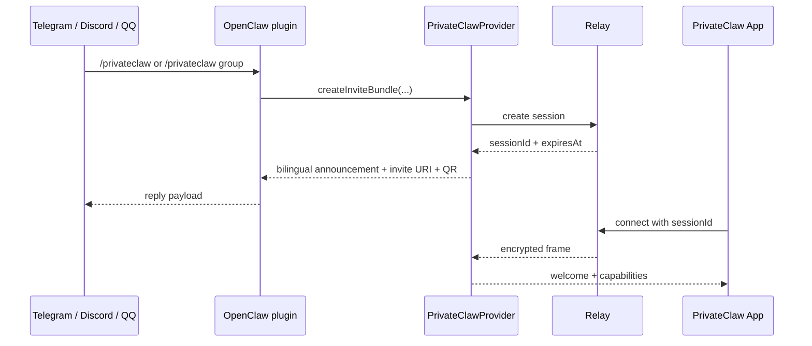

# `@privateclaw/privateclaw`

`@privateclaw/privateclaw` is the npm-publishable runtime behind PrivateClaw sessions.

It is responsible for:

- creating one-time relay sessions,
- optionally turning those sessions into small encrypted group rooms with join/leave presence notices,
- exposing `/renew-session`, `/mute-bot`, and `/unmute-bot` as dynamic built-in PrivateClaw commands when appropriate,
- emitting bilingual Chinese + English invite / CLI / command text for the built-in PrivateClaw surfaces,
- generating encrypted invite QR payloads,
- terminating app-side ciphertext,
- forwarding user messages into an upstream bridge,
- and sending assistant replies back through the relay.

## Provider control flow



## Install

```bash
npm install @privateclaw/privateclaw @privateclaw/protocol
```

The production default relay for this package is:

```text
https://relay.privateclaw.us
```

`openclaw plugins install` accepts a path, archive, or npm package spec. For production, use the npm package:

```bash
openclaw plugins install @privateclaw/privateclaw@latest
openclaw plugins enable privateclaw
```

If you are using the default public relay at `https://relay.privateclaw.us`, the `relayBaseUrl` override is optional and can be skipped. Only run `openclaw config set plugins.entries.privateclaw.config.relayBaseUrl ...` when you want to point the plugin at your own relay deployment.

If npm is not updated yet but you want the newest GitHub checkout immediately, pack the workspace and install the archive:

```bash
TARBALL="$(npm pack --workspace @privateclaw/privateclaw | tail -n 1)"
openclaw plugins install "./${TARBALL}"
openclaw plugins enable privateclaw
```

After `openclaw plugins install`, `openclaw plugins enable`, or any `openclaw config set plugins.entries.privateclaw.config...` change, restart the running OpenClaw gateway/service before testing so it reloads the extension and config. In practice, that means restarting the running `openclaw start` process or whichever service unit hosts your gateway.

For local development from this repository, use a linked checkout and point it at your local relay:

```bash
openclaw plugins install --link ./packages/privateclaw-provider
openclaw plugins enable privateclaw
openclaw config set plugins.entries.privateclaw.config.relayBaseUrl ws://127.0.0.1:8787
```

Because local development changes both the installed plugin and relay target, restart the running OpenClaw gateway/service before testing.

PrivateClaw is not configured with `openclaw channels add privateclaw`. If you want `/privateclaw` to be available inside Telegram/Discord/QQ, add one of those normal OpenClaw channels separately with `openclaw channels add --channel ...`.

## Relay endpoints

If you want to point the provider at a custom relay domain, resolve both sockets from one base URL:

```ts
import { EchoBridge, PrivateClawProvider, resolveRelayEndpoints } from "@privateclaw/privateclaw";

const relay = resolveRelayEndpoints("https://relay.privateclaw.us");

const provider = new PrivateClawProvider({
  ...relay,
  bridge: new EchoBridge("PrivateClaw demo"),
  providerLabel: "PrivateClaw",
});
```

`resolveRelayEndpoints(...)` accepts bare `host:port`, `ws://`, `wss://`, `http://`, and `https://` base URLs.

## Upstream bridge modes

The package ships with:

- `EchoBridge` for local smoke tests,
- `OpenClawAgentBridge` for direct integration with a locally running `openclaw` gateway via `openclaw agent --json`,
- `WebhookBridge` for generic HTTP dispatch,
- `OpenAICompatibleBridge` for local OpenClaw gateways or any OpenAI-compatible chat completions endpoint.

The demo CLI auto-selects bridges in this order:

1. OpenClaw agent bridge
2. OpenAI-compatible gateway
3. Webhook bridge
4. Echo bridge

## OpenClaw plugin entrypoint

The package now ships a real OpenClaw extension entrypoint:

- `index.ts` is exposed through `package.json#openclaw.extensions`
- `openclaw.plugin.json` declares the plugin manifest and config schema
- the plugin registers a real `/privateclaw` plugin command via `api.registerCommand(...)`
- the command returns both the invite URI and a PNG QR code through `ReplyPayload`

That means the installed extension can surface `/privateclaw` and `/privateclaw group` in native command menus such as Telegram instead of relying on the old local shim.

For group sessions, capabilities also advertise `/mute-bot` or `/unmute-bot` depending on the current session state, and `/renew-session` remains available to any participant.

## Demo CLI

```bash
PRIVATECLAW_RELAY_BASE_URL=ws://127.0.0.1:8787 npm run demo --workspace @privateclaw/privateclaw
```

## OpenClaw local pairing command

Once the plugin is installed and enabled, OpenClaw exposes a plugin CLI command:

```bash
openclaw privateclaw pair
```

This starts a local PrivateClaw session and renders the pairing QR code directly in the terminal, without requiring another chat app to trigger `/privateclaw`. It also saves a PNG copy into the OpenClaw media directory, prints that local path, and supports `--open` when you want a browser preview page for the QR.
Fresh sessions created by the provider default to an 8-hour lifetime unless you override `sessionTtlMs`, and the provider emits a reminder once less than 30 minutes remain so any participant can run `/renew-session`.

For a multi-app group session, use:

```bash
openclaw privateclaw pair --group
```

When the provider needs to ask the upstream bridge for a first-time participant nickname, it now uses a deterministic derived bridge session ID that remains UUID-shaped, which avoids leaking malformed `sessionId:participant:...` values into stricter bridge backends.

## Relay deployment

The recommended relay image is built from this repository and published by GitHub Actions to:

```text
ghcr.io/topcheer/privateclaw-relay
```

The root `README.md` covers Docker Compose usage, GHCR image usage, and relay environment variables.

## Publish to npm

From the repository root:

```bash
npm run publish:npm:dry-run
npm run publish:npm
```

`@privateclaw/privateclaw` depends on `@privateclaw/protocol`, so the protocol package must be published first. The combined scripts above publish in that order.

If you are publishing by hand, the minimum safe sequence is:

```bash
npm run publish:protocol
npm run publish:provider
```

Both packages are configured to publish publicly to `https://registry.npmjs.org`.

Important environment variables:

- `PRIVATECLAW_RELAY_BASE_URL`
- `PRIVATECLAW_OPENCLAW_AGENT_BRIDGE`
- `PRIVATECLAW_OPENCLAW_AGENT_BIN`
- `PRIVATECLAW_OPENCLAW_AGENT_ID`
- `PRIVATECLAW_OPENCLAW_AGENT_CHANNEL`
- `PRIVATECLAW_OPENCLAW_AGENT_THINKING`
- `PRIVATECLAW_GATEWAY_BASE_URL`
- `PRIVATECLAW_GATEWAY_CHAT_COMPLETIONS_URL`
- `PRIVATECLAW_GATEWAY_MODEL`
- `PRIVATECLAW_GATEWAY_API_KEY`
- `PRIVATECLAW_WEBHOOK_URL`
- `PRIVATECLAW_WEBHOOK_TOKEN`
